# Paragon 角色技术分析

[Paragon][1]是Epic制作的写实风格的MOBA游戏，它作为虚幻引擎技术的试验田，同时也集成了不少Epic在基于物理渲染方向上的技术探索。

> 本文主要从角色渲染技术入手分析Paragon的美术制作、技术实现。

<!-- [TOC] -->

## PBS材质模型

> [UE4的材质渲染][2]全面拥抱了基于物理的着色模型。

它的优点集中在以下几方面：

* 实时的渲染性能，和传统的Blinn-Phong模型的性能相似
* 线性的参数，支持任意层数的材质混合
* 鲁棒的参数控制（比如粗糙度和金属度），不容易制作出不合常理的材质表现
* 直观的参数接口，比如粗糙度、金属度、基础色

### PBS原理

PBS渲染技术是基于Microfacets（微表面元）理论实现的，它描述了任意表面微观上都是由微小平面构成。

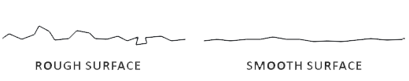

表面越粗糙，反射的光线越混乱，高光的反射拖尾效果越明显；反之，表面越平滑，光线的反射方向越一致，高光越锐利。


光线在粗糙表面上的分布只能用统计的方法去近似，而这个分布状况可以用**粗糙度（Roughness）**做参数来表示。

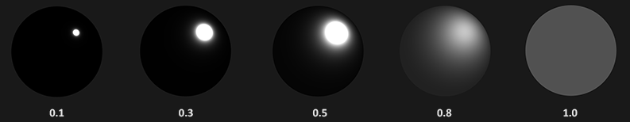

> 上图是不同粗糙度（由低向高）的材质渲染表现。

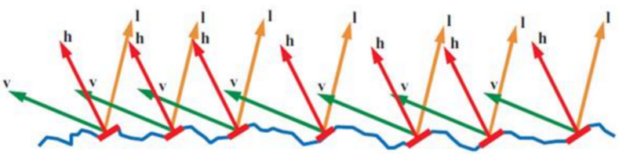

微表面元的近似同样遵守能量守恒定律：即反射的光能不超过入射的光能（除了自发光表面）。

光线反射方程：

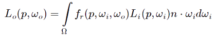

对于表面上P点的辐射照度可以这样计算：

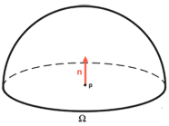

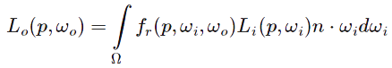

上面式子中的**F**就是**BRDF(双向反射分布函数)**，它描述了入射光和出射光在粗糙度为**a**，表面法向量**n**（实际使用**半角向量h**）两边的分布情况。

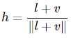

当下流行的实时渲染引擎（Frostbite、CryEngine、Unreal等）都采用了**CookTorrence模型**作为BRDF。

> CookTorrence BRDF包含两部分，Diffuse和Specular项。

#### Diffuse BRDF

Diffuse项最简单的近似方法可以认为光线被均匀地反射到上半球：

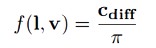

### Specular BRDF

Specular项通常模拟镜子、金属、玻璃一类材质反射、折射后的表现。


最终的CookTorrence渲染方程就成了：

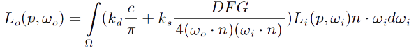

#### D项：

D项是法向分布函数，微表面上的镜面反射能量在统计上分布在半角向量h的两边，UE4中使用GGX近似函数代替D项，其中α代表粗糙度。


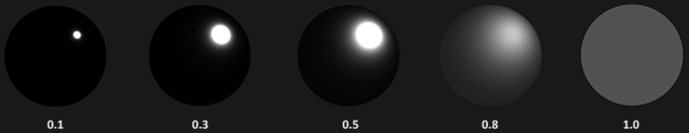

#### G项：


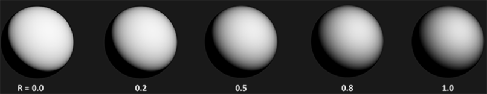

#### F项：

> UE4使用Schlick近似的菲涅尔项来代替F函数。


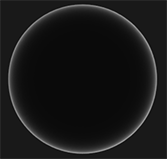

UE4中默认的PBS材质参数有**BaseColor**（基础色）、**Metallic**（金属性）、**Roughness**（粗糙度）等。

#### 制作PBS材质

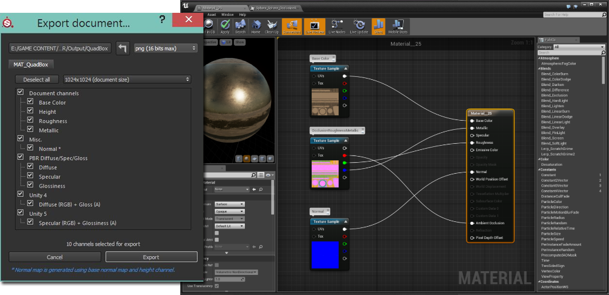
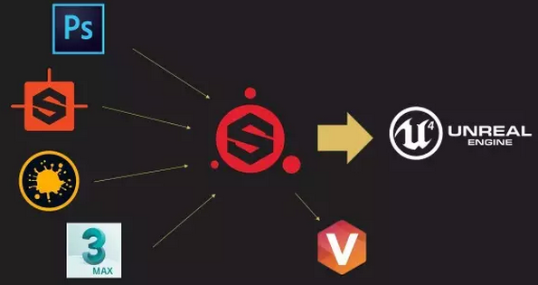

在PBR的制作流程中，我们同样需要对PBR支持比较到位的工具链，**Substance Painter**的默认工作流即支持UE4的PBR流程，在PBR素材制作中较为推荐使用。

### UE4中分层材质

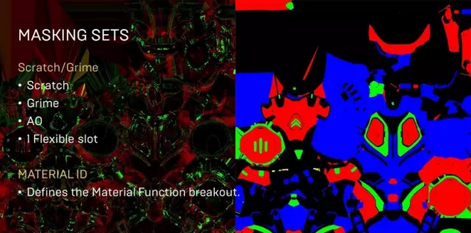

由于PBS模型的各参数是线性的，因而可以通过线性混合或者蒙版方法实现[任意层材质的叠加或分层][12]。

在只含有一个UV通道包含多层的模型，我们可以对各层材质的**BaseColor、Metallic、Roughness**等项分别进行**线性混合**或者**加以蒙板**进行区分，来完成材质的渲染。

这在表现一些效果（比如衣服被水打湿、路面积水蒸发退散）会方便很多。

> 这个方法在**布料渲染、材质细节比较多**的物件渲染中使用较为频繁。

### 布料渲染

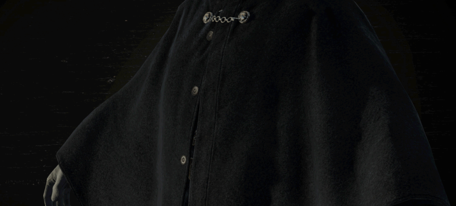

- 布料属于粗糙的材质，镜面高光通常比较低，高光的分布会比较平滑。
- 正面地观察布料，会发现镜面高光很少。
- 布料表面的纤维会发生散射现象。
- 一些织物会有两种镜面高光的颜色。

> UE4的布料材质渲染模型参考了[《教团：1886》的布料渲染方法][8]

因此我们要改造下原来的Microfacet模型，来适配布料的“MicroFiber（微纤维）模型”。

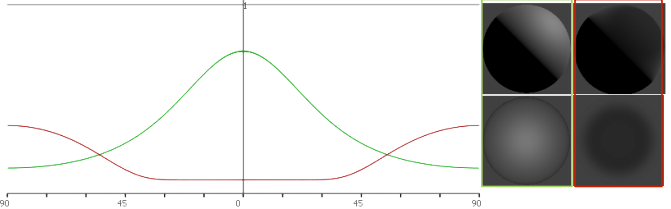

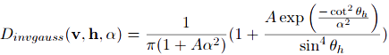

如上图，D项将Beckmann分布中的tan项倒置得到cot项，得到InverseGauss分布函数，该分布函数满足了布料观察得到的能量分布形式。

在UE4的Shader代码中，ClothShading正是受该方法启发，改造GGX得到InvGGX函数作为布料渲染中的D项。

我们来看下UE4**Shaders目录**下ShadingModels.usf的**ClothShading**代码：

```c
	// Cloth - Asperity Scattering - Inverse Beckmann Layer	
	float3 F1 = F_Schlick( FuzzColor, VoH );
	float  D1 = D_InvGGX( LobeRoughness[1], NoH ); // UE4 ClothShading模型中增加了布料粗糙表面散射的项
												   // 这个方法是通过观察布料得到的
	float  V1 = Vis_Cloth( NoV, NoL );
	float3 Spec1 = D1 * V1 * F1;
	// Generalized microfacet specular
	float3 F2 = F_Schlick( GBuffer.SpecularColor, VoH );
	float  D2 = D_GGX( LobeRoughness[1], NoH ) * LobeEnergy[1];
	float  V2 = Vis_SmithJointApprox( LobeRoughness[1], NoV, NoL );
	float3 Spec2 = D2 * V2 * F2;
	float3 Spec = lerp(Spec2, Spec1, Cloth);
	return Diff + Spec;
```

Fuzz Color

### 布料的材质制作

在《教团1886》布料材质的制作过程中大量使用了通过计算机视觉方法来扫描重建布料的表面。

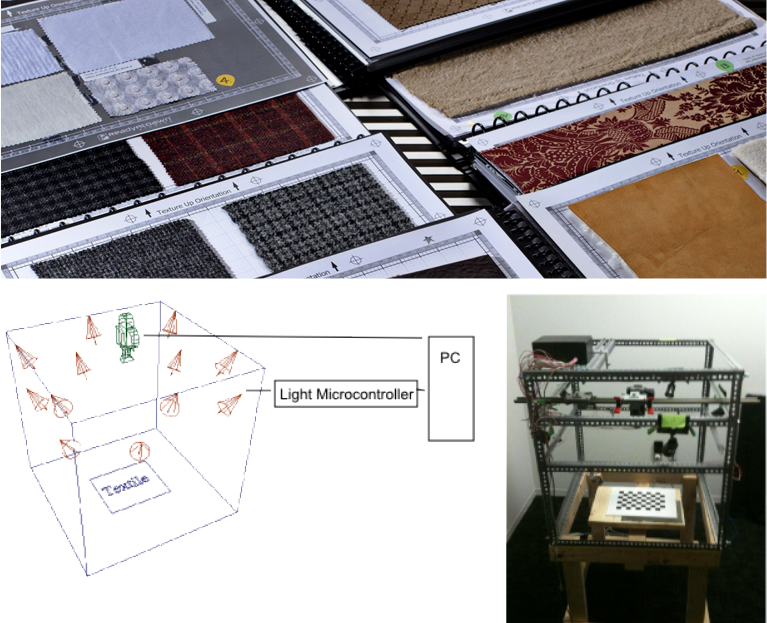

### 布料物理材质制作

## 次表面散射

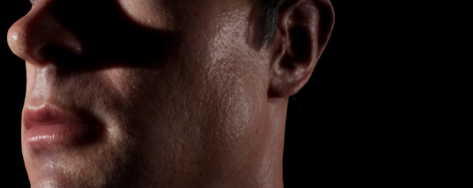

次表面散射效果也是UE4引擎的标配，它的计算是在**屏幕空间**内完成的。
UE4次表面散射的实现参考了Jorge Jimenez在[GPU Pro][3]中撰写的屏幕空间渲染的方法。

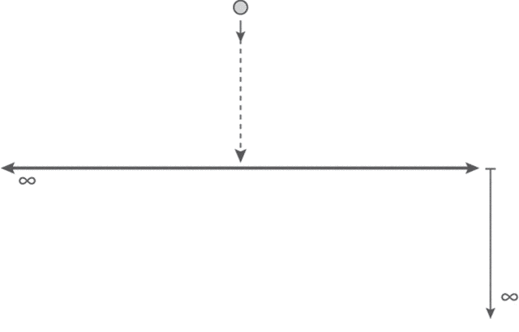

如上图，光线照射到皮肤时，由于皮肤是可透光介质，部分光在皮肤内会被吸收，部分会经过皮肤内部反射出去。

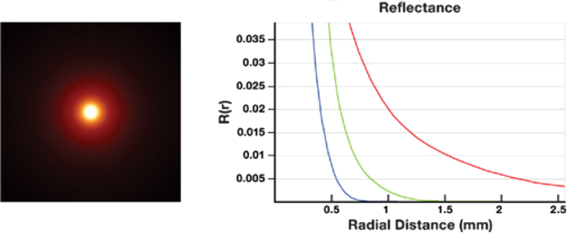

物理上，不同颜色的**波长/频率**不同，在皮肤传递的过程中，**衰减的幅度**也不相同。如上图。

在实际的计算中，我们假定反射的光线能量在入射点的分布成**正态分布**。

### 皮肤渲染

在UE4中，次表面散射的计算实现和上面提到的Jorge Jimenez提出的方法类似，通过在屏幕空间
卷积次表面的深度贴图，依据光源的位置和散射半径计算出散射颜色。

> 以下是Jorge Jimenez给出的样例代码，详细实现可参考[Github](https://github.com/iryoku/separable-sss)

```c
float4 BlurPS(PassV2P input, uniform float2 step) : SV_TARGET {
    // Gaussian weights for the six samples around the current pixel:
    //   -3 -2 -1 +1 +2 +3
    float w[6] = { 0.006,   0.061,   0.242,  0.242,  0.061, 0.006 };
    float o[6] = {  -1.0, -0.6667, -0.3333, 0.3333, 0.6667,   1.0 };
    // Fetch color and linear depth for current pixel:
    float4 colorM = colorTex.Sample(PointSampler, input.texcoord);
    float depthM = depthTex.Sample(PointSampler, input.texcoord);
    // Accumulate center sample, multiplying it with its gaussian weight:
    float4 colorBlurred = colorM;
    colorBlurred.rgb *= 0.382;
    // Calculate the step that we will use to fetch the surrounding pixels,
    // where "step" is:
    //     step = sssStrength * gaussianWidth * pixelSize * dir
    // The closer the pixel, the stronger the effect needs to be, hence
    // the factor 1.0 / depthM.
    float2 finalStep = colorM.a * step / depthM;
    // Accumulate the other samples:
    [unroll]
    for (int i = 0; i < 6; i++) {
        // Fetch color and depth for current sample:
        float2 offset = input.texcoord + o[i] * finalStep;
        float3 color = colorTex.SampleLevel(LinearSampler, offset, 0).rgb;
        float depth = depthTex.SampleLevel(PointSampler, offset, 0);
        // If the difference in depth is huge, we lerp color back to "colorM":
        float s = min(0.0125 * correction * abs(depthM - depth), 1.0);
        color = lerp(color, colorM.rgb, s);
        // Accumulate:
        colorBlurred.rgb += w[i] * color;
    }
    // The result will be alpha blended with current buffer by using specific
    // RGB weights. For more details, I refer you to the GPU Pro chapter :)
    return colorBlurred;
}
```

### 皮肤制作

Paragon的角色使用的材质是次表面轮廓模式（Subsurface Profile），皮肤的资源包含Diffuse、Roughness（存储在Diffuse的Alpha通道）、
Specular、Normal、Scatter 4份贴图。

| 贴图 | 类型 | 描述 |
|:-:|:---|:---|
|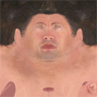|皮肤漫反射贴图|作为PBS材质的基础颜色|
|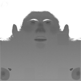|**粗糙度**贴图|粗糙度是单通道参数，可以合并在漫反射贴图的Alpha通道中|
|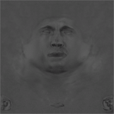|皮肤高光贴图|表现皮肤不同部位的镜面高光反射率|
|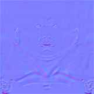|法线贴图|用来展示皮肤的纹路细节|
||散射贴图|表示皮肤各个部分的散射强度，散射的颜色由次表面轮廓颜色参数控制（SubSurface Profile Color）|

### 头发光照

Paragon中的头发光线传播模型是基于[Marschner][4]的单条头发路径建模的。

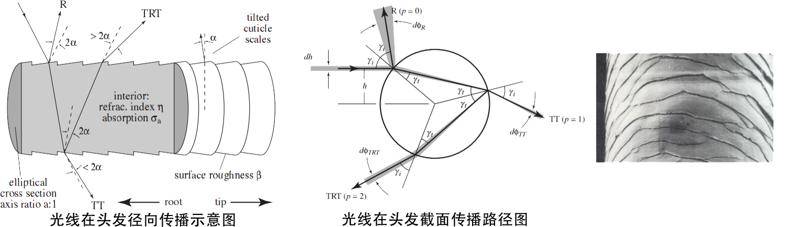

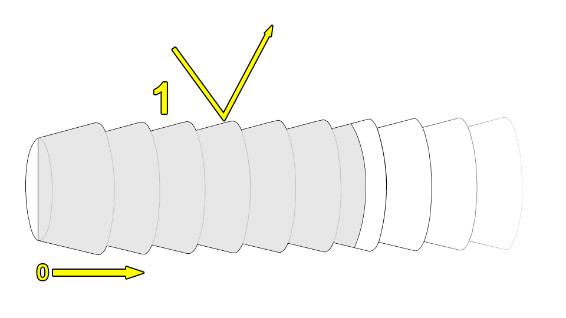

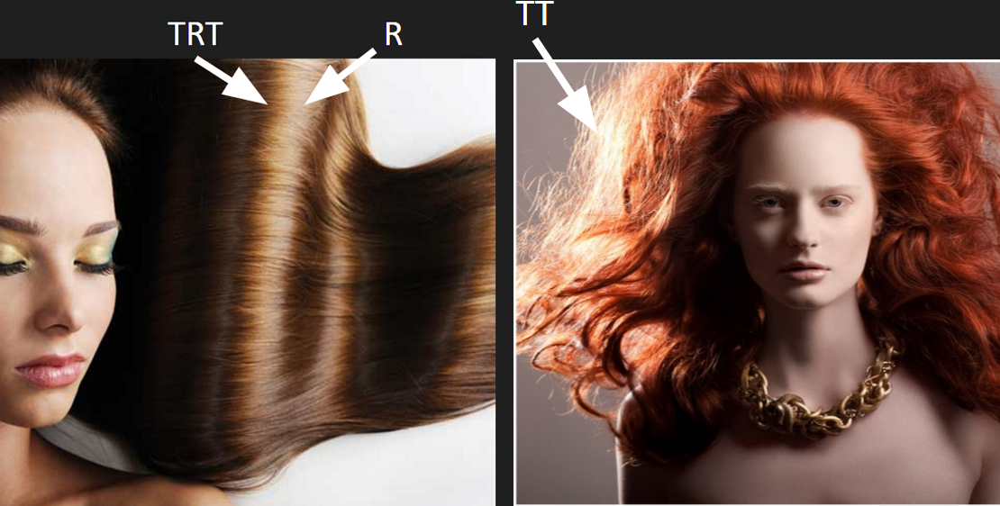

* R: 直接反射路径，主要反射高光。
* TRT: 折射-反射-折射路径，光线通过该路径穿入头发丝，在发丝内表面反射，然后折射出去，产生次要反射高光。
* TT: 折射-折射路径，代表光线在大量头发中进行散射的过程。

#### Marschner’s 模型分解

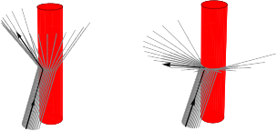


> 式子中的**p**代表**光线传播路径（R、TT、TRT）**，theta（i，r）是光线入射和出射角，phi是散射夹角（**见截面传播路径图**）。

上面这个式子的散射项又可以分解为**径向散射分布函数M**和**截面散射函数N的乘积**。


M是概率分布函数表示发丝径向散射，这里可以采用**高斯分布函数**来近似。

N是发丝截面散射函数，这里**R，TT，TRT各个路径需要分别计算**。

#### Epic的着色模型

UE4头发着色的算法实现有两套，一份是参考Weta方法实现的，
另一份是对Weta方法的近似（逻辑曲线拟合）实现。
实现的理论基础参考“An Energy-Conserving Hair Reflectance Model”论文。
由于Weta的头发着色计算复杂度较高，在计算截面散射函数N的过程中，
Epic采用了较多的**Curve Fitting方法近似计算**。

##### 径向散射函数M

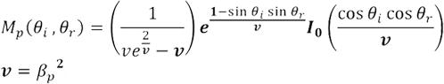

> 式子中的beta代表粗糙度。

Weta基于能量守恒的计算方法过于昂贵，
Epic的实现直接采用了高斯函数来近似表示径向反射的能量分布，
如下式：

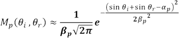

##### 截面散射函数Nr (直接反射路径)

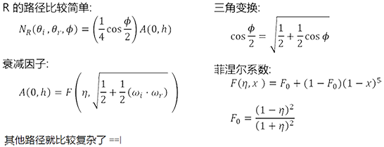

##### 截面散射函数Ntt,trt

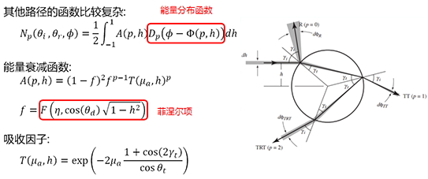

##### 截面散射函数Ntrt（内部反射再次折射路径）

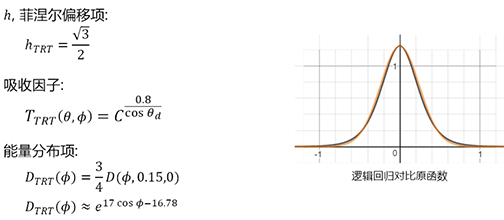

##### 截面散射函数NTT（两次折射路径）

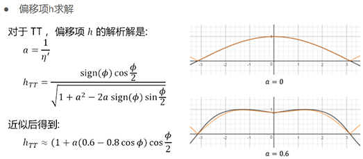

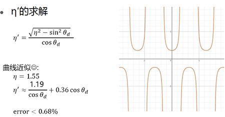

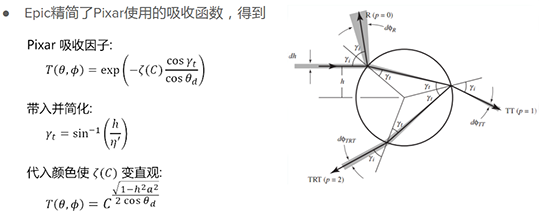

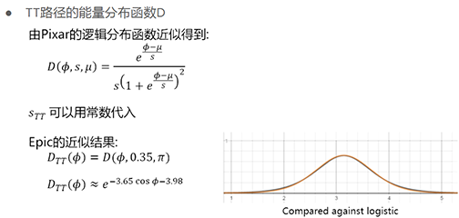

#### Weta vs Epic

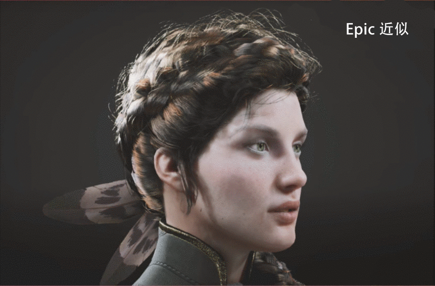

### 美术可控参数

### 头发素材制作


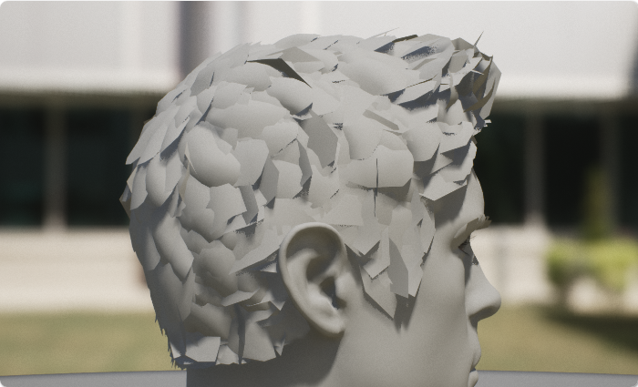

|贴图|类型|说明|
|:---:|:---:|:---|
|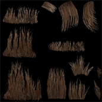|漫反射贴图|做为头发丝的底色|
|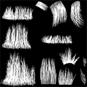|Alpha蒙版贴图|使用蒙版测试（AlphaTest）方法来渲染头发丝，剔除透明的部分|
|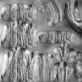|头发ID贴图|灰度图，控制头发网格对应的发丝类型|
|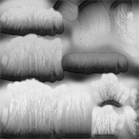|发根-发梢渐变贴图||
|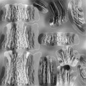|深度贴图|用于像素深度，让头发更有层次感，减少大面积的高光。|

### 头发各向异性高光表现实现（Anisotropic Specularity）

#### 切线贴图/FlowMap

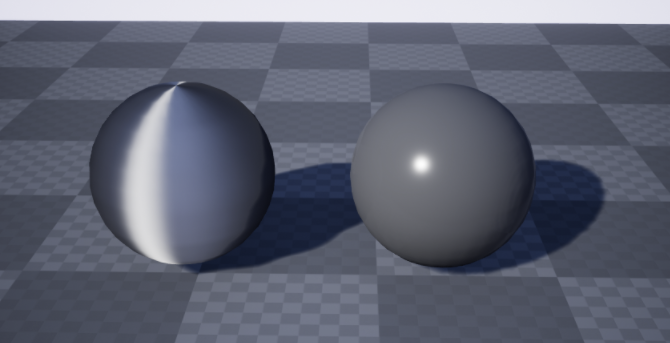

> Tangent可以用于各向异性反射的渲染。

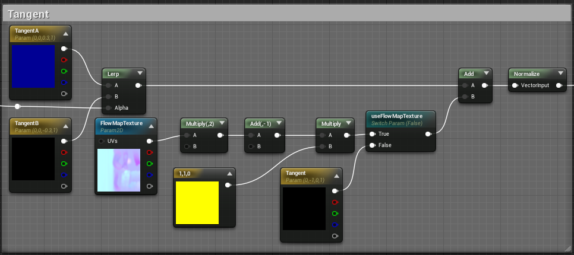

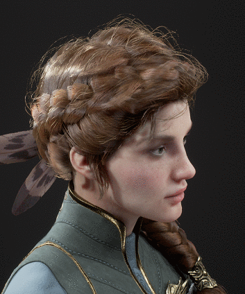

> flowmap可以让部分头发丝看起来更弯曲，它代表头发在切线空间移动的方向，可以影响头发的反射。


#### 使用像素深度偏移

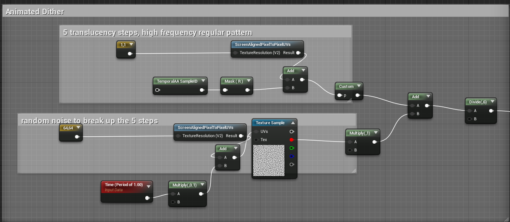

通俗的说，增加像素深度会让像素远离相机。通过赋予每簇头发不同的深度，从而让头发看起来更有层次。


<!-- ### 眼球着色


> 如上图，眼球的生理构造包含：
> 
- 巩膜（Sclera）
- 角膜缘（Limbus）
- 虹膜（Iris）
- 瞳孔（Pupil）
- 眼角膜（Cornea）


眼球内部的折射

### 眼球素材制作

网格和UV分布如下图所示：


眼球的网格可直接使用ContentExample


#### 眼球着色器参数 -->


## 参考资料

- [Real Shading in Unreal Engine 4][2]
- [PBR Theory][11]
- [Arbitrarily Layered Micro-Facet Surfaces][12]
- [Moving Frostbite to Physically Based Rendering][6]
- [Importance Sampling for Physically-Based Hair Fiber Models][5]
- [Light Scattering from Human Hair Fibers][4]
- [Photorealistic Character][10]
- [Physically Based Hair Shading in Unreal][9]
- [Screen-Space Perceptual Rendering of Human Skin][3]
- [Distribution-based BRDFs][7]
- [Crafting a Next-Gen Material Pipeline for The Order: 1886][8]
- [Unreal Engine 4给Paragon角色赋予生命][13]

[1]:https://www.epicgames.com/paragon
[2]:http://blog.selfshadow.com/publications/s2013-shading-course/karis/s2013_pbs_epic_notes_v2.pdf
[3]:http://www.iryoku.com/sssss/
[4]:http://www.graphics.stanford.edu/papers/hair/hair-sg03final.pdf
[5]:https://cg.ivd.kit.edu/publications/pubhanika/2013_hairbrief.pdf
[6]:http://www.frostbite.com/wp-content/uploads/2014/11/course_notes_moving_frostbite_to_pbr.pdf
[7]:http://www.cs.utah.edu/~premoze/dbrdf/dBRDF.pdf
[8]:http://blog.selfshadow.com/publications/s2013-shading-course/rad/s2013_pbs_rad_slides.pdf
[9]:http://blog.selfshadow.com/publications/s2016-shading-course/karis/s2016_pbs_epic_hair.pdf
[10]:https://docs.unrealengine.com/latest/INT/Resources/Showcases/PhotorealisticCharacter/?utm_source=launcher&utm_medium=ue&utm_campaign=uelearn
[11]:https://learnopengl.com/#!PBR/Theory
[12]:https://www.cg.tuwien.ac.at/research/publications/2007/weidlich_2007_almfs/weidlich_2007_almfs-paper.pdf
[13]:http://mp.weixin.qq.com/s/lF34ypY8pVnp_9W-WvC5kg