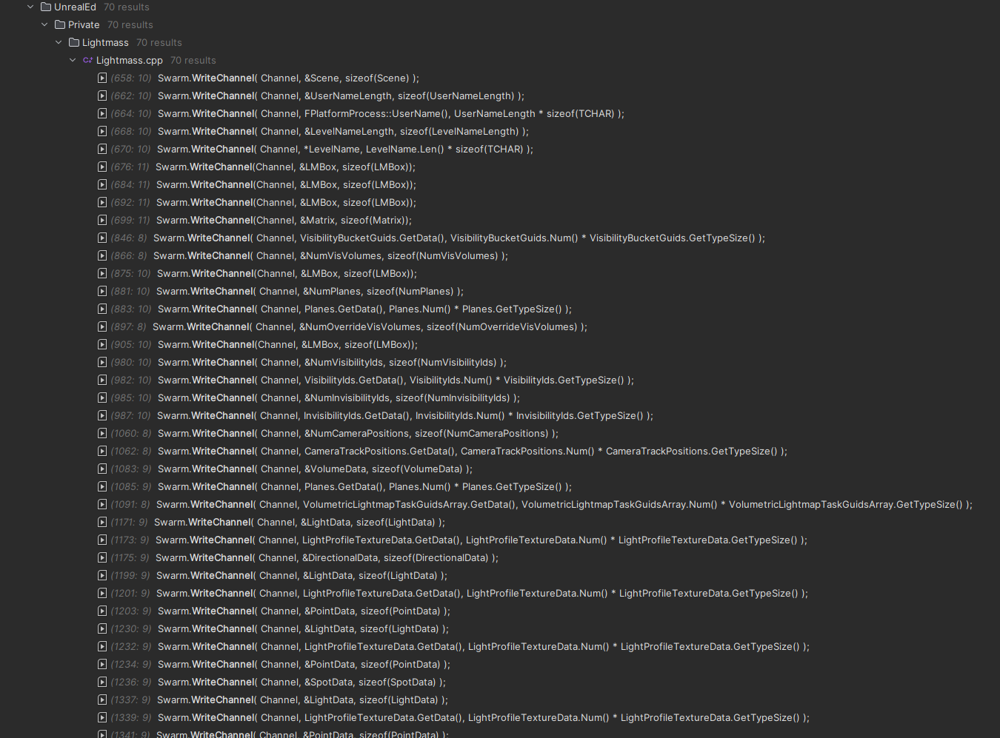
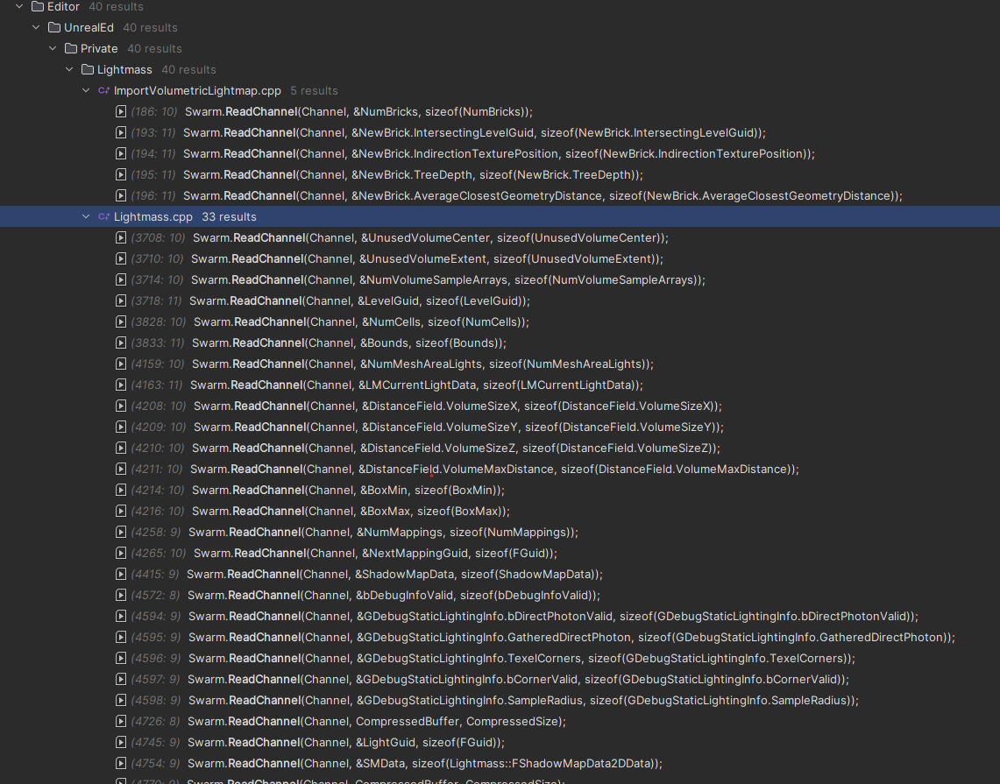
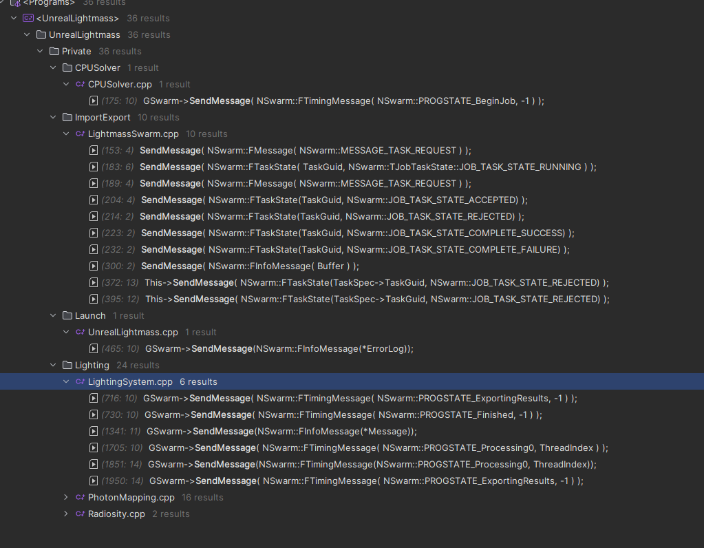
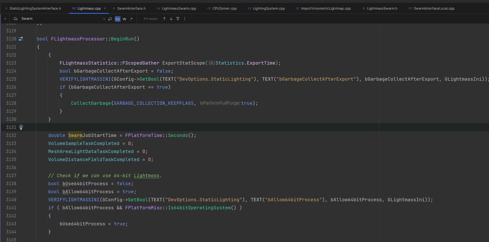
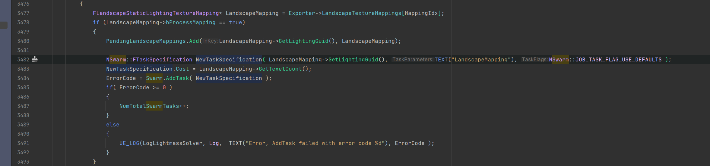
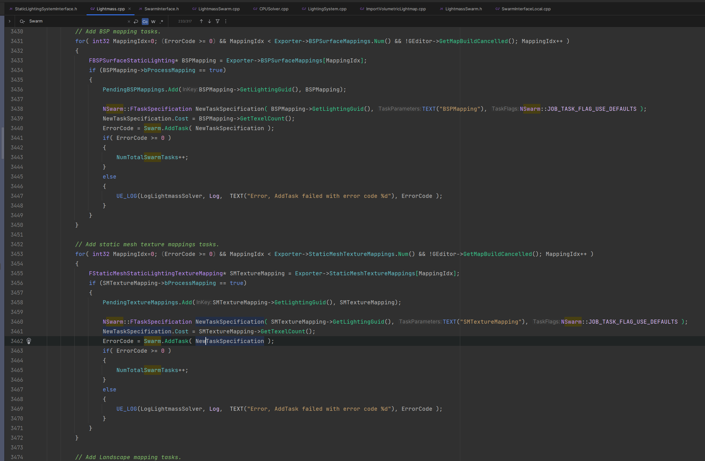
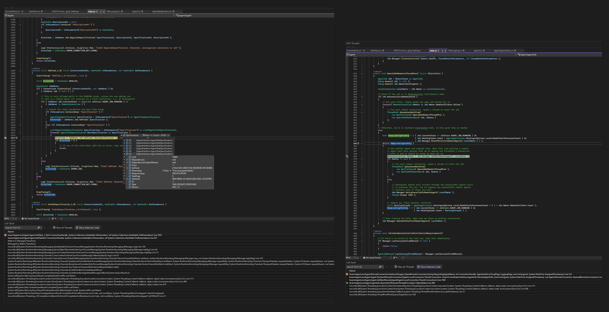
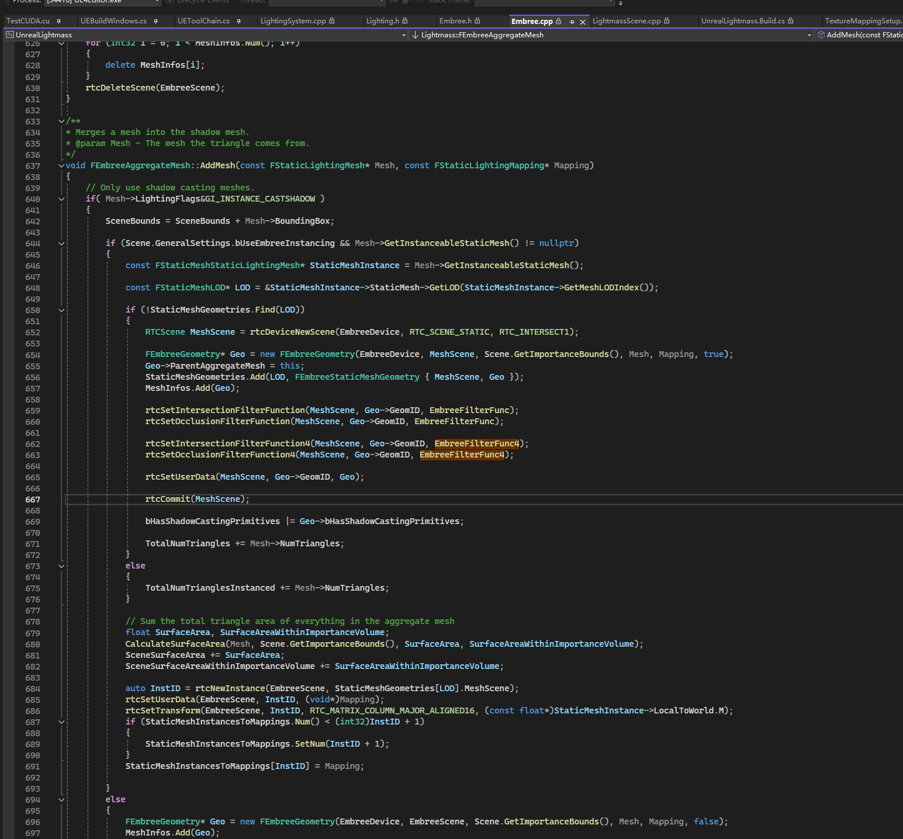
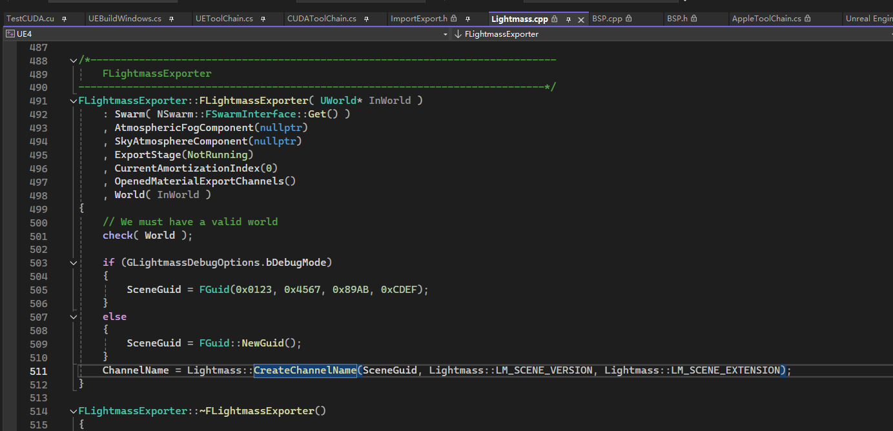
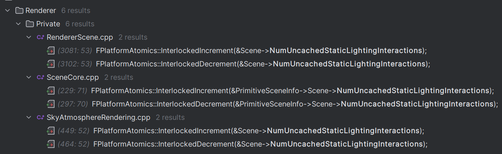

Lightmass
===

支持 `Mac` 和 `Windows`

# 数据流

* UE4Editor
    * Export scene, static meshes, lights, materials to file
        * 由 `UEditorEngine::BuildLighting` 发起
        * `Editor/UnrealEd/Private/StaticLightingSystem/StaticLightingSystem.cpp` 这个部分比较重要，负责导出导入
            * FStaticLightingSystem::CreateLightmassProcessor
            * FStaticLightingSystem::GatherScene
            * > FStaticLightingSystem::FinishLightmassProcess
        * `Editor/UnrealEd/Private/Lightmass/Lightmass.cpp` FLightmassProcessor 
    * Start **Swarm**, prepare job depend files
    * OpenChannel, start job
* SwarmAgent
    * Launch UnrealLightmass
* UnrealLightmass
    * Finish
    * UE4Editor import build data

## 基础组件

* DotNet实现
    * AgentInterface.dll
    * SwarmCommonUtils
    * SwarmCoodinatorInterface
    * SwarmInterface（位于Editor/SwarmInterface）
        * tcp://127.0.0.1:8008/SwarmAgent 通信地址

### Swarm的交互负责的工作

* 收发场景数据，包括Mesh、Material、Texture、Light等数据
    
    
* 消息通知
    
* 任务创建
    * OpenJob
    * BeginJobSpecification


### Swarm 协议格式

### Swarm 分布式节点的工作

#### 防火墙设置

由于Swarm使用的`.NET Remoting` RPC框架**不再安全**，容易被安全软件阻止，需要禁用防火墙或者安全软件。

如何划分工作的



按类型遍历创建任务

```cpp
int32 ErrorCode = Swarm.BeginJobSpecification( JobSpecification32, JobSpecification64 ); 通过它创建各种子任务（Task）
```





## SwarmAgent接受任务



### Lightmass代码拆解

Embree 参与了什么工作？


#### Editor 导出部分

为什么要写文件？文件发挥了什么作用？

`Programs\UnrealLightmass\Public\ImportExport.h`



#### Lightmass 烘焙部分

原理见[Lightmass的算法解析](light_mass_photon_mapping.md)

Emit Photons
```cpp
void FStaticLightingSystem::EmitDirectPhotons(
	const FBoxSphereBounds& ImportanceBounds, 
	TArray<TArray<FIndirectPathRay> >& IndirectPathRays,
	TArray<TArray<FIrradiancePhoton>>& IrradiancePhotons)
{
	GSwarm->SendMessage( NSwarm::FTimingMessage( NSwarm::PROGSTATE_Preparing0, 0 ) );
```

Texture Mapping（有Embree加速），软件光栅化，SurfaceCache


#### Editor 导入部分 BuiltData

## 可加速计算部分

[Luoshuang's Lightmass](https://github.com/AlanIWBFT/UnrealEngine/blob/GPULightmass-4.22.0-release/Engine/Source/Programs/UnrealLightmass/Private/Lighting/GPULightmass.cpp)

[dawnarc's](https://github.com/dawnarc/GPULightmass/tree/master/EngineModification-SourceBuildOnly-4.22.0)


CUDA加速部分

optix engine能参与哪部分工作？

optix

hip/hiprt/ROCm

oneAPI/embree sycl

neural cache?

ISPC AVX512加速部分

## 可分布式计算部分

## IncrediBuild 集成统一调度


## Unbuilt Objects

