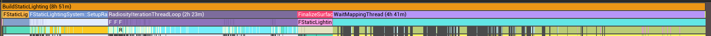

# Lightmass耗时分析

基于CPU Lightmass大规模场景场景烘焙的主要耗时在以下几个函数：

* IrradiancePhotonCache阶段 [CacheIrradiancePhotons:EmitPhotons] ~ 1Hr
    * RasterizeToSurfaceCacheTextureMapping
* SetupRadiosity阶段 ~ 1Hr
    * RadiositySetupTextureMapping
        * RadiosityCacheSetup
* RadiosityIteration阶段，和Bounce次数成正比 ~ 5Hr
    * RadiosityCache
* FinalizeSurfaceCache阶段，~ 0.5Hr
    * FinalizeSurfaceCacheTextureMapping
* ProcessTextureMapping阶段，~ 4Hr
    * CalculateIndirectLightingTextureMapping
        * ProcessCacheIndirectLightingTask
        * CalculateDirectAreaLightingTextureMapping
    * ProcessVolumetricLightmapBrickTask

优化这部分代码可以参考Luoshuang/Yujiang Wang先生实现的[Luoshuang GPU Lightmass][1]以及Epic官方的GPULightmass插件（同样由Wang实现）

[1]:https://github.com/AlanIWBFT/GPULightmass
