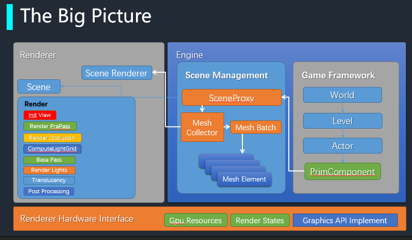
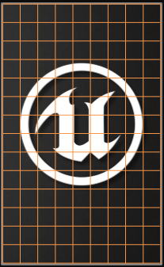
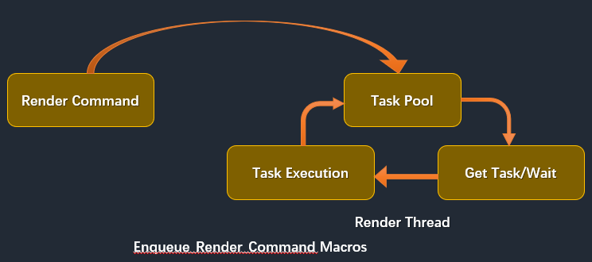
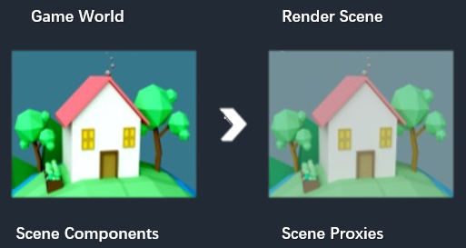

# Unreal Insight：渲染器的实现

## GPU硬件

### 移动GPU

### 桌面GPU

### 分块渲染的优势

## 渲染器

### 场景和光源阴影管理

* 八叉树实现场景光源和物件管理

### 多线程渲染

### 渲染过程

### 光源裁剪

* 前向渲染

### 光照和阴影

### 移动端渲染器

### VR前向渲染器

### 延迟渲染器

### 后处理特效实现

* HDR & Bloom
* DoF
* SSR

## 渲染硬件接口层(Render Hardware Interface)

