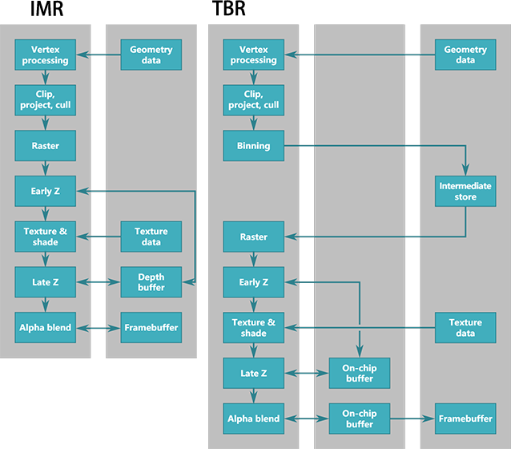

# Unreal Insight：渲染器的实现

## GPU硬件

首先我们来看下GPU硬件上是如何实现他们的渲染管线：

目前的GPU主要支持**立即渲染（Immediate-Mode Renderers, IMRs）**和**分块延迟渲染（Tile-Based Renderers，TBRs）**的架构。

**立即渲染架构**的GPU主要存在在桌面GPU和主机GPU上，他的主要特征是几何图元立即被硬件渲染管线处理，这意味着，所有的图元都将被整个硬件渲染管线遍历，而且不利用任何的图元的预处理信息和处理后的信息。

**分块渲染架构**普遍应用在移动端GPU上，包括**PowerVR、ARM、Adreno**等GPU，而NVIDIA的Tegra（Pascal、Kepler架构）是个特例，使用了混合的架构。

### 移动GPU

### 桌面GPU

### 分块渲染的优势

## 渲染器

### 场景和光源阴影管理

* 八叉树实现场景光源和物件管理

### 多线程渲染

### 渲染过程

### 光源裁剪

* 前向渲染

### 光照和阴影

### 移动端渲染器

### VR前向渲染器

### 延迟渲染器

### 后处理特效实现

* HDR & Bloom
* DoF
* SSR

## 渲染硬件接口层(Render Hardware Interface)

