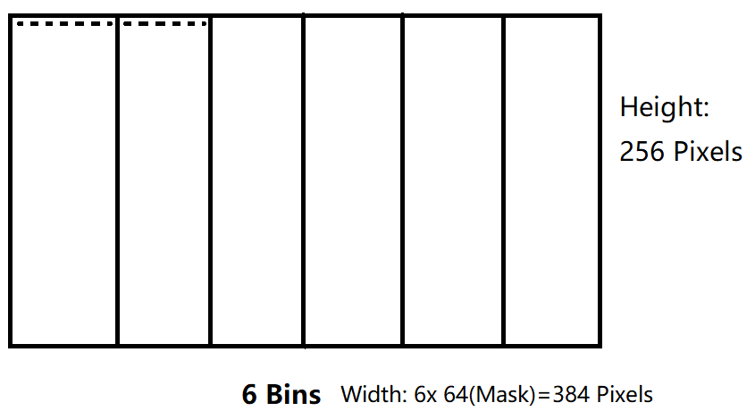
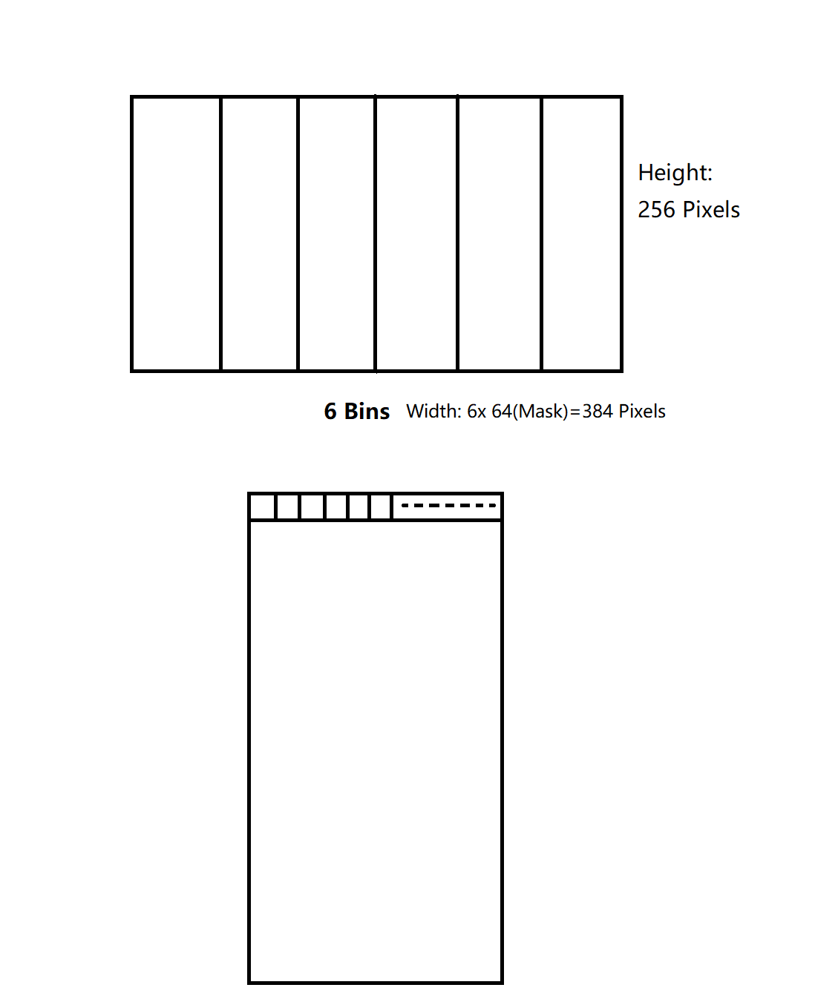

# UE4用于移动端的软光栅遮挡剔除实现

* Process Occluder Geom
* Process Occludee Geom
* Triangles Bin Sort
* Rasterize Triangles

---

## Process Occluder Geometries

Transform triangles to clip space, and bin the triangles to framebuffer bins.

Framebuffer bins are stored with triangle min depth and index.

> Binning?

> If the bin intersect the triangle, add it to the bin.

## Process Occludee Geometries

Project primitive bounding box to screen quad with max depth.

Then triangulate generated quads and bin the generated triangles with occludee mark.

## Bin Sort (Foreach Bin)

Sort triangles inside bins by depth. (Closer first)

## Rasterize (Foreach Bin)

### Mask Calculation

Mask is used to record coverage 

### Occluder

Sort triangle vertices by Y, split to 2 halves to raterize.

### Occludee

## References

* [Masked Occlusion Culling]()