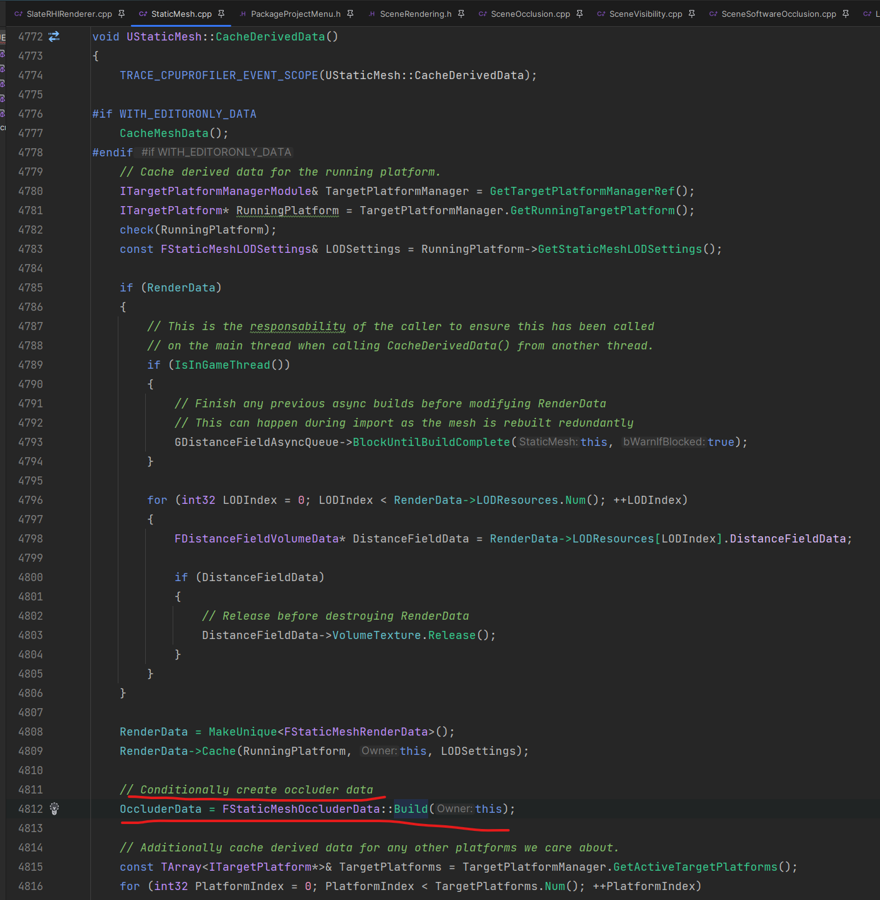

Occlusion Data生成路径
===

# 数据生成

**LODForOccluderMesh >= 0**

该方法 UStaticMesh::PostLoad() 和 UStaticMesh::BatchBuild() <- UStaticMesh::Build() <- PostEditChangeProperty/GenerateLodsInPackageRemoveVertexColors

# 数据序列化

CookingTarget() Windows下是**TGenericWindowsTargetPlatform**而不是其他（比如FAllDesktopPlatform）

