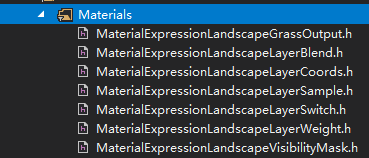
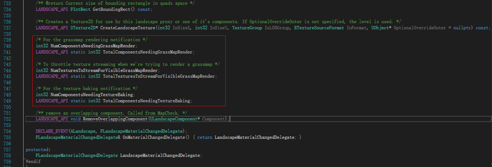
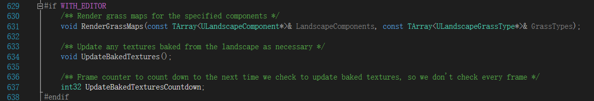
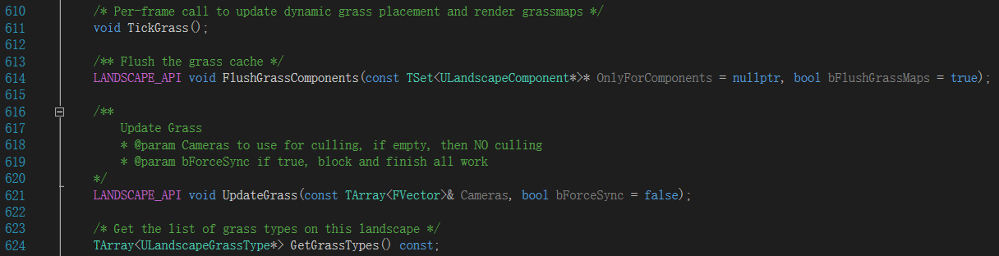
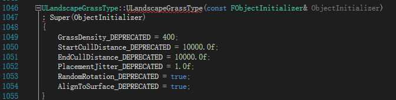
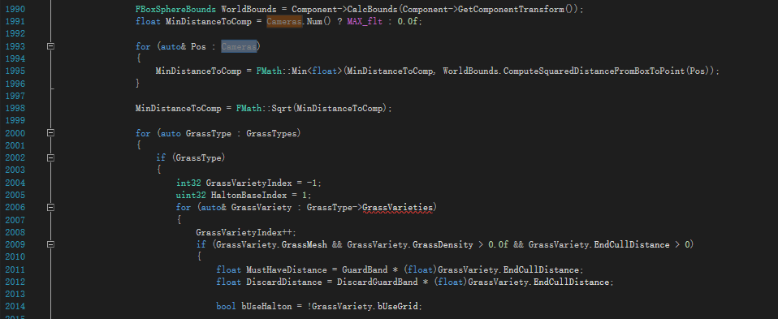
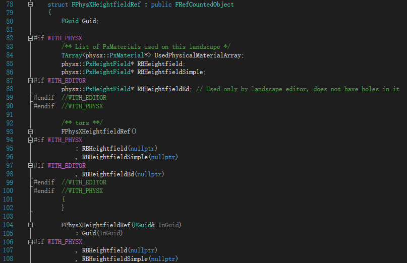

# Unreal Insight: Landscape 模块分析

## 地形支持的材质表达式

## 地形渲染

### Weight Map

LandscapeComponent

* SectionBaseX
* SectionBaseY
* WeightMapTextures
* XYOffsetmapTexture
* WeightmapSubsectionOffset
* HeightmapScaleBias
* HeightmapTexture
* GIBakedBaseColorTexture

* RenderGrassMap()

### Grass Map

### Render GrassMap

## 草的裁减

### Landscape Grass

### 材质

* LandscapeMaterial
* LandscapeHoleMaterial

### 光照

* LightMassSetting
* StaticLightingResolution
* bCastShadowAsTwoSided
* LightChannels

### 层次混合

### LOD

* NumSubsections
* SubsectionSizeQuads
* LandscapeSectionOffset
* LODDistanceFactor
* StreamingDistanceMultiplier
* LODFalloff
* MaxLODLevel

## 高度场碰撞体

相关参数控制：

* CollisionThickness

