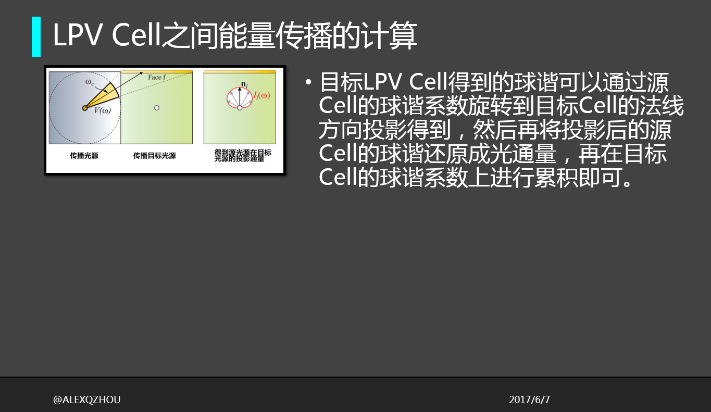

# Unreal Insight：光传播体动态全局光照（Light Propagation Volumes）

## Reflective Shadow Maps（反射性阴影贴图）

## Light Propagation Volumes（光传播体算法）

## 参考资料

* [Cascaded Light Propagation Volumes for Real-Time Indirect Illumination][1]
* [Tobias Alexander Franke's Blog][2]
* [Reflective Shadow Maps][3]
* [Light Propagation Volumes in CryEngine 3][4]
* [Spherical Harmonic Lighting: The Gritty Details][5]
* [Eric Polman's Blog][6]

[1]:https://pdfs.semanticscholar.org/24aa/f35de490996b7d4d43e2cdc63f60a2a00b89.pdf
[2]:http://www.tobias-franke.eu
[3]:https://classes.soe.ucsc.edu/cmps160/Spring13/proposal/mijallen/proposal/media/p203-dachsbacher.pdf
[4]:http://www.crytek.com/download/Light_Propagation_Volumes.pdf
[5]:http://silviojemma.com/public/papers/lighting/spherical-harmonic-lighting.pdf
[6]:http://ericpolman.com/light-propagation-volumes/
