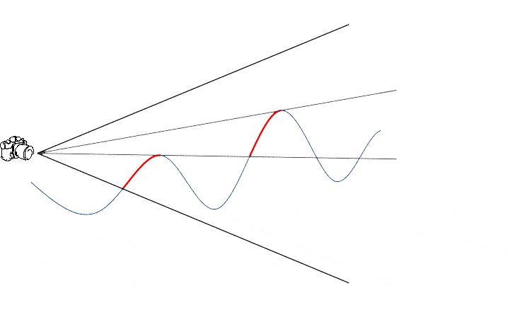
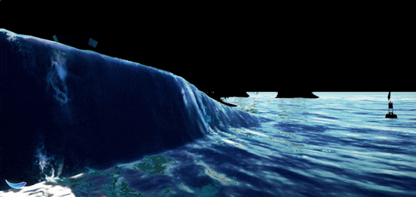

# SIGGRAPH 2017高级渲染技术课程：海洋渲染技术

## Depth Peeling

* 从近到远分层渲染网格到不同层的深度纹理
	* DEPTH状态可读写
	* 如果当前渲染的顶点深度值小于前一层深度纹理对应坐标的值则放弃写入
	* 把当前渲染到的深度纹理作为前一层的深度纹理用于下一层渲染
* 每次渲染表面的时候，同时记录光线在海水FontLayer和BackLayer之间的吸收值
* 我们使用StencilBuffer标记被遮挡的像素，用于快速的Discard，当然我们也标记了像素是否在水体中
* 最终，所有层渲染完后就是海面的颜色。

