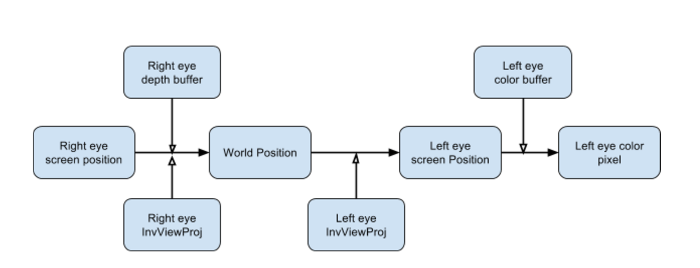
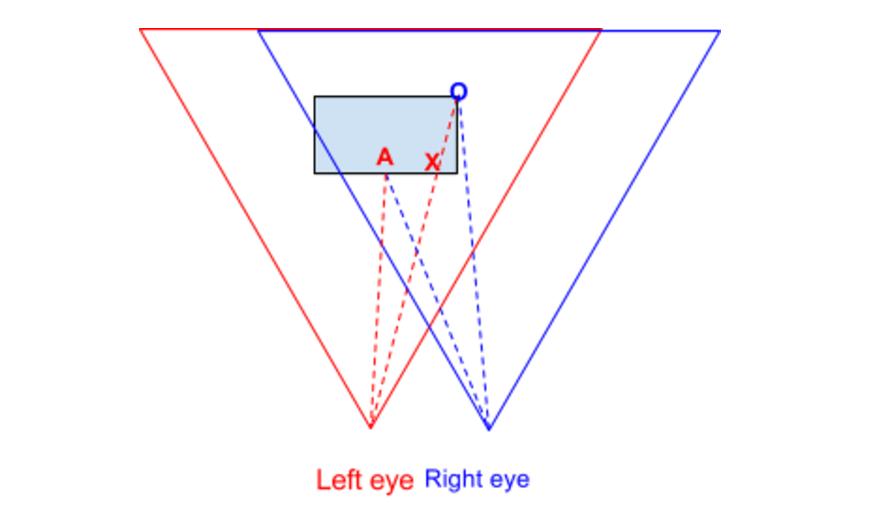
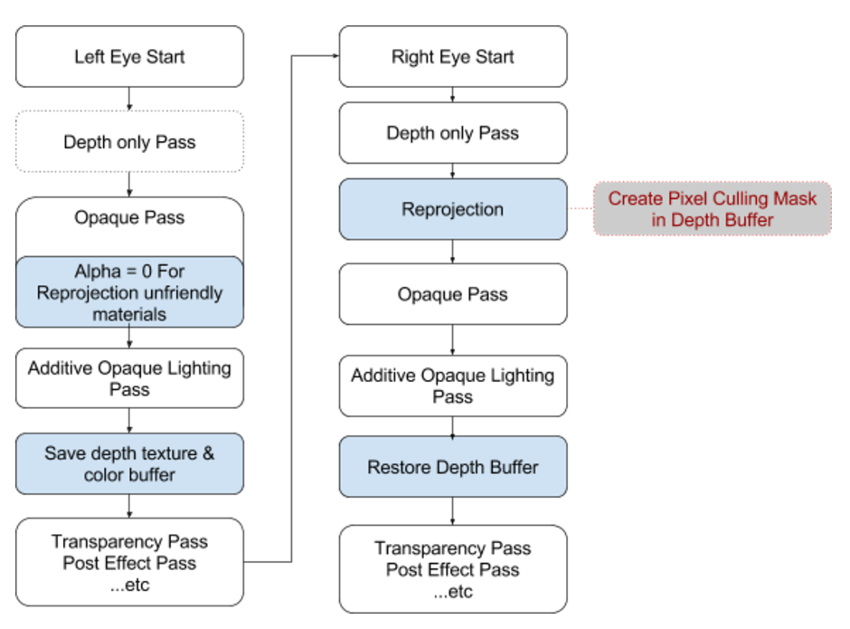

# Oculus VR 着色重投影优化

## 基本的思路

* 渲染左眼图像：在透明物体渲染前保存DepthBuffer和ColorBuffer
* 渲染右眼图像：保存右眼的DepthBuffer，仅渲染深度
* 重投影：利用左右眼渲染保存下来的DepthBuffer，将左眼的ColorBuffer重投影至右眼，并生成Pixel Culling Mask
* 继续右眼的非透明渲染步骤，仅计算那些未被Pixel Cull Mask覆盖到的像素
* 清理Pixel Culling Mask

## 实际实现方案



### 遮挡区域检查



如上图的O点，它是右眼看到的位置，但在左眼看到的位置是X点。

### 像素剔除蒙版（Pixel Culling Mask）

> 深度测试或者蒙版测试都可以用来像素剔除，可以基于引擎来选择：

* Stencil Rejection：对于有EarlyZ Pass的引擎来说，可以使用StencilBuffer来标记正确的重投影区域。然后在渲染不透明过程对需要重投影的物体启用蒙版测试，反之关闭蒙版测试。
* Depth Rejection：对于没有EarlyZ Pass的引擎使用Stencil Rejection方案就不是最合适的方案了。比如，Unity的DepthPass仅仅是生成深度纹理，不透明物体光照的过程完全使用新的深度纹理。
  如果需要重投影的区域缺少对应的DepthBuffer，留空即可，但会导致后面透明材质渲染的错误。为解决这个问题，我们采用了如下方案：
	* 对于重投影不友好的材质，我们在渲染左眼的时候在Alpha通道上标记为0。
	* 当执行重投影过程的时候，在对比左右眼深度的同时检查左眼的ColorBuffer Alpha通道：如果为0，就不进行重投影；当然，
	  由于缺少Stencil的输出，冲投影使用的全屏方形需要放置在近相机裁减平面，并启用深度写入。这意味着所有可被重投影的区域将会输出用于后面剔除像素的深度值。
    * 打开深度测试，正常渲染不透明的过程（+光照）
    * 从深度纹理恢复原来保存的DepthBuffer，用于后续正常的渲染


### 保守的重投影滤波

大致的实现代码如下：

**重投影**

```c
// 保守的重投影滤波
float GetOtherEyeConservativeDepth(float2 otherEyeUV)
{
    float otherEyeDepth = OtherEyeDepthTexure.Sample(OtherEyeDepthSampler, otherEyeUV + float2(0, 2 / DepthBufferSize.y), 0);
    otherEyeDepth = max(otherEyeDepth, OtherEyeDepthTexure.Sample(OtherEyeDepthSampler, otherEyeUV + float2(2 / DepthBufferSize.x, -2 / DepthBufferSize.y), 0));
    otherEyeDepth = max(otherEyeDepth, OtherEyeDepthTexure.Sample(OtherEyeDepthSampler, otherEyeUV + float2(-2 / DepthBufferSize.x, -2 / DepthBufferSize.y), 0));
    return otherEyeDepth;
}

[pixelshader] float4 ReprojectionPassPS(ProjectionVS2PS In) : SV_Target
{
	float depth = DepthTexture.Sample(DepthSampler, In.UV);
    float4 clipSpacePos = float4(In.UV * 2.0 - 1.0, depth, 1);
	float4 worldPos = mul(InvViewProj, clipSpacePos); // 从深度纹理重建坐标位置
	worldPos.xyz /= worldPos.w;

	float4 otherClipSpacePos = mul(OtherEyeViewProj, float4(worldPos.xyz, 1));
	otherClipSpacePos.xyz /= otherClipSpacePos.w;

	float2 otherEyeUV = otherClipSpacePos.xy*0.5 + 0.5;
	float4 otherEyeColor = OtherEyeDepthTexure.Sample(OtherEyeDepthSampler, otherEyeUV, 0);
	float isReprojectable = otherEyeColor.a; // 材质是否适合重投影，不适合就直接不渲染

	// Verify if if it is a valid reprojection by using conservativeFilter
	float otherEyeDepth = GetOtherEyeConservativeDepth(otherEyeUV);
	float diff = otherEyeDepth - depth;
	if (diff > DepthThreshold * isReprojectable) // 遮挡区域剔除（深度相差过大）
	{
		discard;
	}
	
	return ReprojectionMaskColor * otherEyeColor;
 }
```

**保存和恢复DepthBuffer**
```c
#include "/Engine/Public/Platform.ush"
struct ProjectionVS
{
    float4 Position : POSITION;
    float2 UV : TEXCOORD0;
};

struct ProjectionVS2PS
{
    float4 Position : SV_POSITION;
    float2 UV : TEXCOORD0;
};

SamplerState DepthSampler;
Texture2D DepthTexture;

SamplerState OtherEyeDepthSampler;
Texture2D OtherEyeDepthTexure;

float4x4 OtherEyeViewProj;
float4x4 InvViewProj;

// xy:DepthBufferSize.xy, zw:1/DepthBufferSize.xy
float4 DepthBufferSize;
float4 ReprojectionMaskColor;

#define DepthThreshold    0.001f

[vertexshader] ProjectionVS2PS CopyDepthVS(ProjectionVS In)
{
    ProjectionVS2PS Out;
	Out.Position = WorldPositionToLocal(In.Position);
	Out.UV = In.UV;
	return Out;
}

[pixelshader] float4 CopyDepthPS(ProjectionVS2PS In) : SV_Target
{
	float z = DepthTexture.Sample(DepthSampler, float4(In.UV, 0, 0));
	return float4(z.xxx, 1);
}
```

## 限制

重投影可能不能适用所有场景，它存在着以下限制：

* 当前实现基于Unity，Unreal和其他引擎的集成不会太麻烦。
* 它是纯GPU像素着色的优化，如果你的应用不是Pixel-Bound的话，不会有太大的优化效果，甚至有额外的开销。
* 它要求左右眼按顺序渲染，所以不适用Single Pass Stereo Rendering。
* 对于像镜子、水体、Parallax Occlusion Mapping的材质，需要关闭重投影。
* 对于Unity的实现，深度缓冲的保存和恢复会影响透明渲染中的Depth Cull的效率。

## 流程



> Unity项目[链接][1]，[原文][2]

[1]:http://beta.unity3d.com/download/396ab58c4e90/UnityDownloadAssistant-5.6.0p4.exe?_ga=2.149477558.1693590436.1502128604-60660381.1486692714
[2]:https://developer.oculus.com/blog/introducing-stereo-shading-reprojection-for-unity/