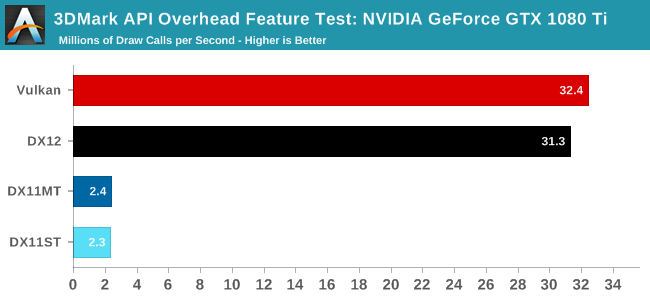

# Draw Call优化的一些思考

当Profile游戏应用的帧率瓶颈发生在CPU时，你可能要注意GFX API接口的调用占比，他很可能是低帧率的元凶。
优化DrawCall的方向有两个：

* 引擎层的Renderer改造
* 游戏资源的改造

## AZDO (Approaching Zero Driver Overhead)

为什么Driver会产生Overhead？

* 传统的DX11/OGL图形驱动在每个API调用期间都会**检查调用参数、资源是否符合逻辑**，Validation这部分会消耗一部分时间
* 为了提高API调用的容错性，**GPU/CPU内存分配**的时机也存在不确定性
* GFX Object的**绑定操作以及同步**也消耗了CPU时间

为了减少上述的开销，GFX API提供了AZDO的接口供开发者使用。

在传统的DX11和OGL接口下，使用提供的Indirect Drawing接口就能实现AZDO的调用。

* DrawIndexedInstancedIndirect
* glMultiDrawElementsIndirect

> DX11调用

``` c
DrawElementsIndirectCommand* commands = ...;
foreach( object )
{
	writeUniformData( object, &uniformData[i] );
	writeDrawCommand( object, &commands[i] );
}
updateCommands(drawArgsBuffer, commands, commandCount);
context->DrawIndexedInstancedIndirect(drawArgsBuffer, 0);
```

> OGL调用

``` c
DrawElementsIndirectCommand* commands = ...;
foreach( object )
{
	writeUniformData( object, &uniformData[i] );
	writeDrawCommand( object, &commands[i] );
}
glMultiDrawElementsIndirect(
	GL_TRIANGLES,
	GL_UNSIGNED_SHORT,
	commands,
	commandCount,
	0
)
```

* 使用Indirect Draw绘制批次模型，可以减少CPU绘制时间，前提是同批次绘制的模型的渲染状态以及资源绑定类型必须一致。
* 在资源绑定阶段，针对纹理的绑定可考虑使用TextureArrayObject来减少绑定次数，Buffer直接拷贝即可。
* 资源绑定的方式也可以使用驱动厂商提供的BindLess接口最优化开销，但会增加代码复杂度。

> 渲染状态包括Shader、RasterState/DepthStencil/VertexLayout/PrimitiveTopology等。

### Shader改造

使用Indirect Draw方法后，针对资源的绑定代码，可以考虑重建绘制ID与资源ID的索引。

## 传统的Mesh、Texture合并

* UE4引擎中针对场景中的静态物体也可以通过HLOD系统实现模型的合并来减少DrawCall数目
* 在Android的字体/UI渲染库同样使用了ATLAS、BatchRendering完成DrawCall的合并

### 彩虹6号DrawCall优化实践

* 基于材质的DrawCall分发系统（本质上是分批次渲染）
* 统一的Buffer定义（方便资源绑定）
	* VertexBuffer
	* IndexBuffer
	* ConstantBuffer
	* StructBuffer表示DrawCall的参数
	* Shader的自动生成允许我们快速验证新的模型
* DrawCall收集
	* 每一个批次绘制对应一个IndirectDraw的命令

优化结果：

|未合批次的DrawCall数目|合批次的DrawCall数目（VIS+GBuffer+贴花）|合批次的DrawCall数目（阴影）|剔除效率提升|
|:--:|:--:|:--:|:--:|
|10537|412|64|73%|

## 多线程Command Buffer构建提交

如果将Renderer的接口使用迁移至DX12级别的接口（VK/MTL），在驱动的优化下DrawCall的提交效率可以提升十倍，通过GPU命令的并行绑定和提交，最大程度的榨干GPU的机能。



如上图，在3DMark的测试中，在相同时间下，**Vulkan和DX12的DrawCall数**最多可以达到**DX11的13倍**，驱动带来的优化比较明显。

* 即使是在DX12级别的API下，传统的DrawCall优化方法仍有应用的空间。

# 参考

1. [Approaching Zero Driver Overhead](https://www.slideshare.net/CassEveritt/approaching-zero-driver-overhead)
2. [Rendering Rainbow Six](http://twvideo01.ubm-us.net/o1/vault/gdc2016/Presentations/El_Mansouri_Jalal_Rendering_Rainbow_Six.pdf)
3. [Android HWUI硬件加速模块浅析](https://github.com/TsinStudio/AndroidDev)