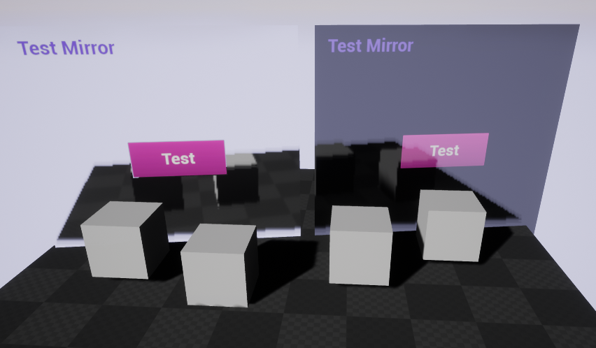
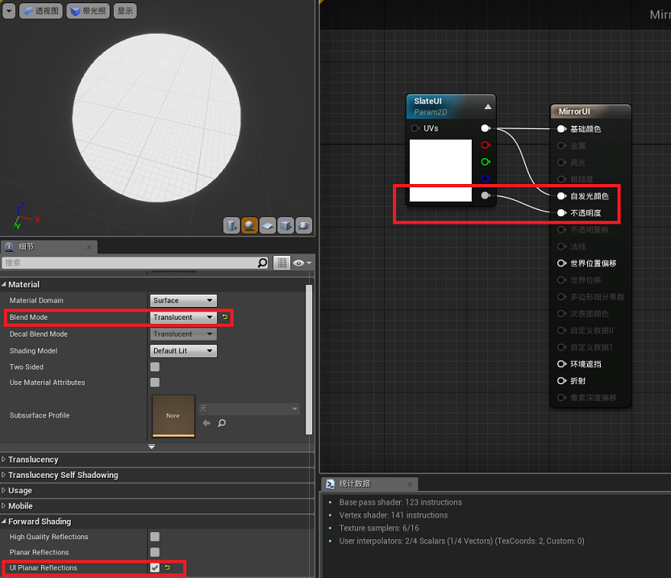

UE4下实现UMG与PlanarReflection混合

见Commit：[https://github.com/TsinStudio/UnrealEngine/commit/371557e1ef003d8ecca65343deee23f9ee03ceff](https://github.com/TsinStudio/UnrealEngine/commit/371557e1ef003d8ecca65343deee23f9ee03ceff)