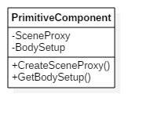
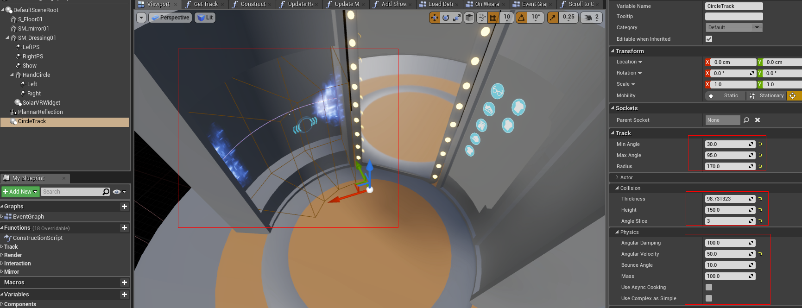

# UE4实现碰撞体的动态调整

## PrimitiveComponent的组成

UE4通过组合场景渲染代理（SceneProxy）和物理模拟实体（UBodySetup）完成PrimitiveComponent的创建。



其中SceneProxy主要任务是告诉Renderer如何渲染当前PrimitiveComponent，
BodySetup是Component实现物理模拟和碰撞检测的代理类，它以简化的几何体来表示实际模型的碰撞几何体（Box/Capsule/Convex）。


因此为实现可动态改变的碰撞体，我们只要实现以下接口即可：

``` cpp
    //-------------- Collision Data Provider -------------------//
    virtual bool GetPhysicsTriMeshData(struct FTriMeshCollisionData* CollisionData, bool InUseAllTriData) override;
    virtual bool ContainsPhysicsTriMeshData(bool InUseAllTriData) const override;
    virtual bool WantsNegXTriMesh() override;
    virtual void GetMeshId(FString& OutMeshId) override;
    //-------------- Collision Data Provider -------------------//
```

## 通过PhysX Cook ConvexMesh完成BodySetup的创建

我们在Component完成注册的步骤上增加了程序化的碰撞体生成(见UpdateBodySetup方法)：

``` cpp
void UCircleTrack::OnRegister()
{
    Super::OnRegister();
    UpdateBodySetup();
}
```

首先我们要创建新的BodySetup：

``` cpp
UBodySetup* UCircleTrack::CreateBodySetup()
{
    auto BodySetup = NewObject<UBodySetup>(this, NAME_None, (IsTemplate() ? RF_Public : RF_NoFlags));
    BodySetup->BodySetupGuid = FGuid::NewGuid();
    BodySetup->bGenerateMirroredCollision = false;
    BodySetup->bDoubleSidedGeometry = true;
    BodySetup->CollisionTraceFlag = bUseComplexAsSimple ? CTF_UseComplexAsSimple : CTF_UseDefault;
    return BodySetup;
}
```

然后程序通过计算生成新的凸包体（ConvexMesh, 由多个四面体组成）：

``` cpp
	CollisionConvexElems.Reset();

    ...
    for (int32 i = 0; i < AngleSlice; i++)
    {
        FKConvexElem Elem;
        ...
        Elem.VertexData.Add(...);
        Elem.ElemBox = FBox(Elem.VertexData);

        CollisionConvexElems.Add(Elem);
    }
```

最后调用PhysX Cook生成物理引擎使用的几何体：

``` cpp
    if (bUseAsyncCook)
    {
        AsyncBodySetupQueue.Add(CreateBodySetup());
    }
    else
    {
        AsyncBodySetupQueue.Empty();
        if (ArcBodySetup == nullptr)
        {
            ArcBodySetup = CreateBodySetup();
        }
    }
    UBodySetup* UseBodySetup = bUseAsyncCook ? AsyncBodySetupQueue.Last() : ArcBodySetup;
    UseBodySetup->AggGeom.ConvexElems = CollisionConvexElems;
    UseBodySetup->CollisionTraceFlag = bUseComplexAsSimple ? CTF_UseComplexAsSimple : CTF_UseDefault;
    /* 4.17 Support
    if (bUseAsyncCook)
    {
        UseBodySetup->CreatePhysicsMeshesAsync(FOnAsyncPhysicsCookFinished::CreateUObject(this, &UCircleTrack::FinishPhysicsAsyncCook, UseBodySetup));
    }
    else*/
    {
        // New GUID as collision has changed
        UseBodySetup->BodySetupGuid = FGuid::NewGuid();
        // Also we want cooked data for this
        UseBodySetup->bHasCookedCollisionData = true;
        UseBodySetup->InvalidatePhysicsData();
        UseBodySetup->CreatePhysicsMeshes();  // Cook Convex Mesh
        RecreatePhysicsState();
    }
```

我们可以使用它来实现弧状的碰撞体，用于一些交互的响应，如下图：



提供了如夹角、细分段数等参数调节。