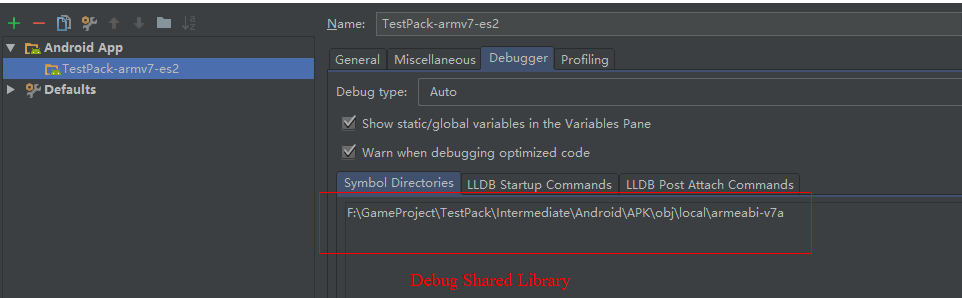
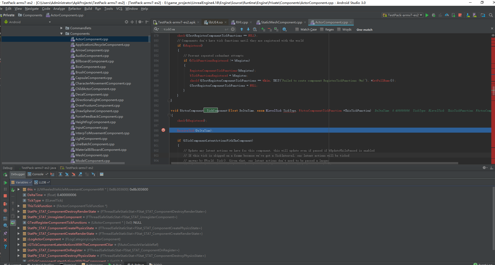
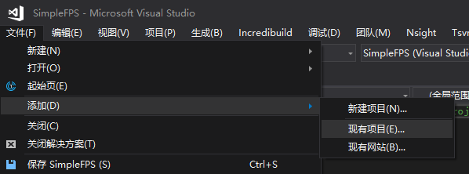
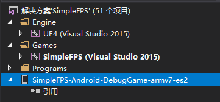
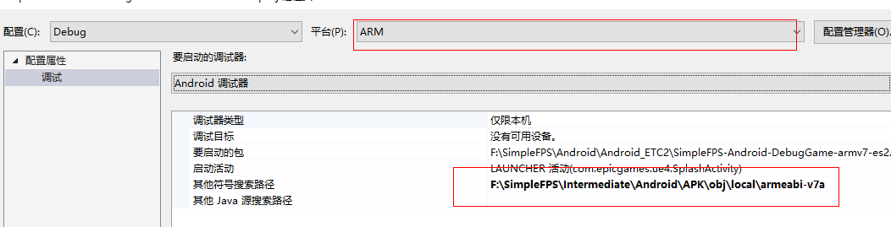
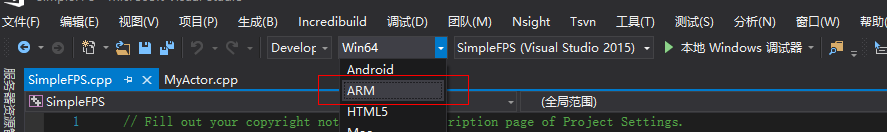
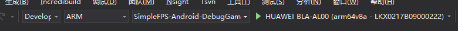
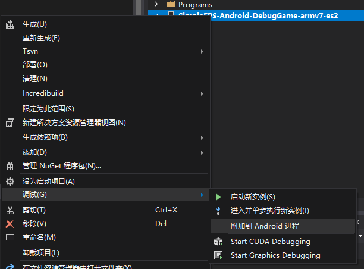

# UE4引擎在Android下的C++调试

目前支持Android C++调试的IDE主要有Android Studio以及Visual Studio（需要安装CrossPlatform开发组件）。

> 当然你也可以使用GDB/LLDB进行命令行调试

## 使用Andorid Studio调试UE4引擎代码

### APK打包

使用UE4打包Development/Debug版本APK，安装完成后，再打开Android Studio点击Debug And Profile APK。

### 设置Debug版本动态库路径

### Debug动态库路径设置完成后，启动调试即可

## 使用Visual Studio进行Android C++调试

### Debug动态库路径设置完成后，启动调试即可

进程Attach上就可以愉快的Debug引擎代码了。