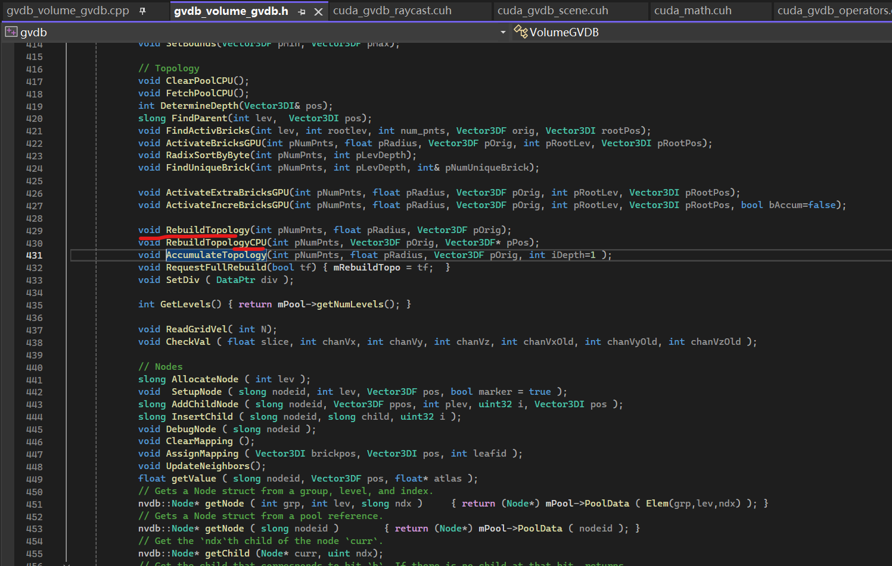
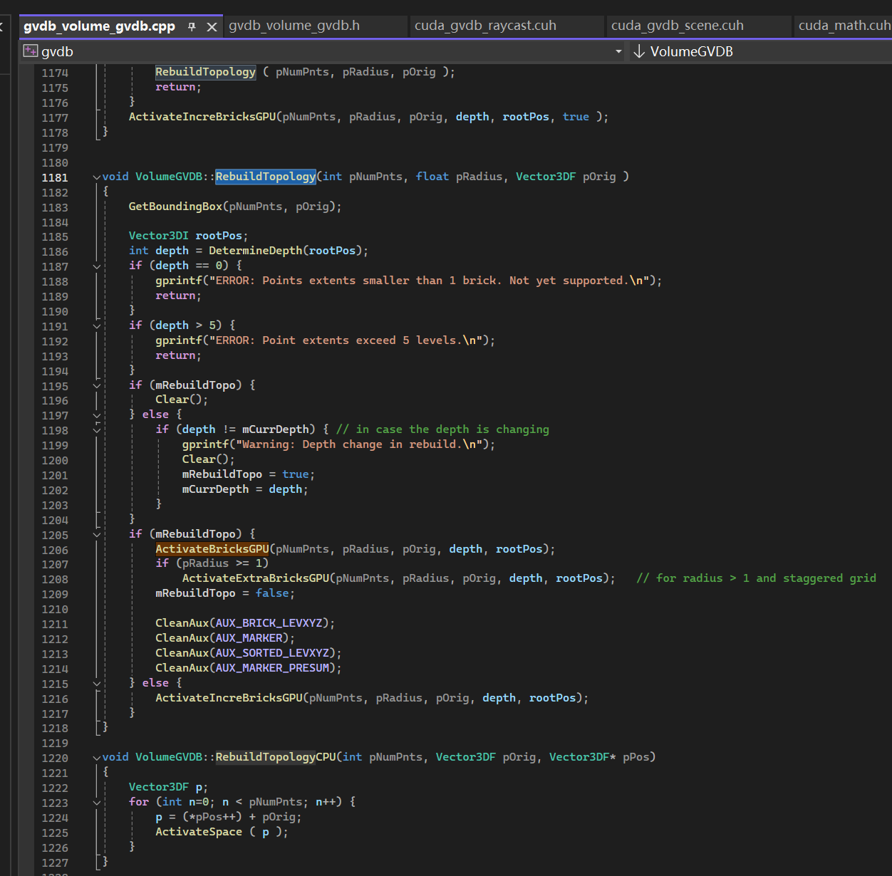
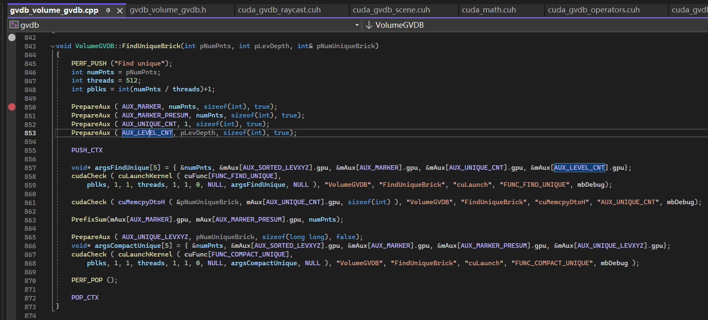
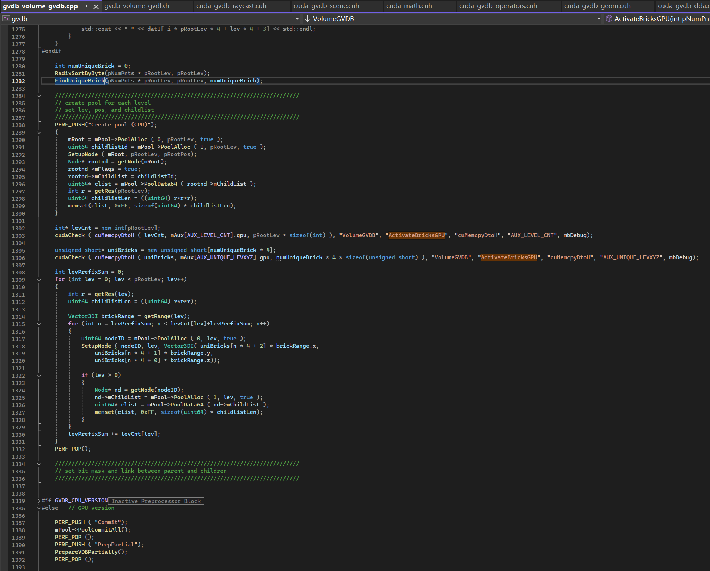
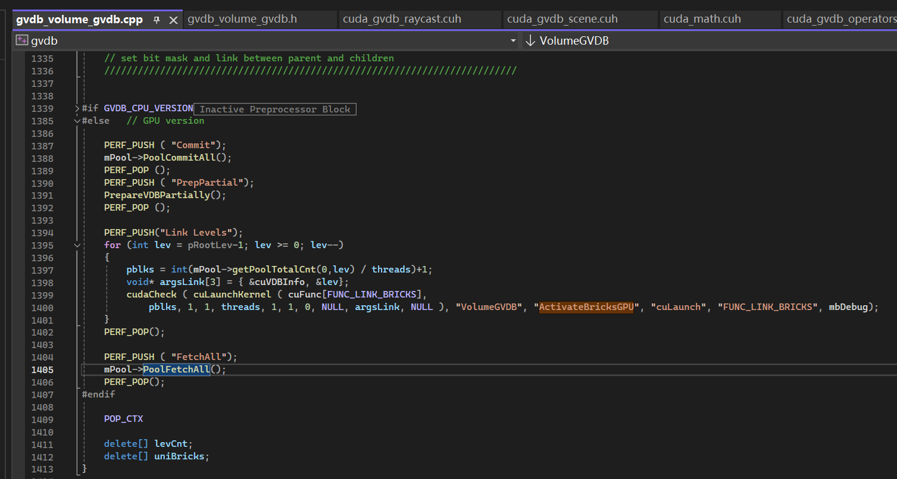

GVDB源码分析
===

关键代码位于 **gvdb_volume_gvdb.cpp**

下面这些代码能够基本定义GVDB体素的构建、更新、以及邻近查找

```c
Line: 286

// Topology
LoadFunction ( FUNC_FIND_ACTIV_BRICKS,	"gvdbFindActivBricks",			MODL_PRIMARY, "cuda_gvdb_module.ptx" );	
LoadFunction ( FUNC_BITONIC_SORT,		"gvdbBitonicSort",				MODL_PRIMARY, "cuda_gvdb_module.ptx" );	
LoadFunction ( FUNC_CALC_BRICK_ID,		"gvdbCalcBrickId",				MODL_PRIMARY, "cuda_gvdb_module.ptx" );	
LoadFunction ( FUNC_RADIX_SUM,			"RadixSum",						MODL_PRIMARY, "cuda_gvdb_module.ptx" );	
LoadFunction ( FUNC_RADIX_PREFIXSUM,	"RadixPrefixSum",				MODL_PRIMARY, "cuda_gvdb_module.ptx" );
LoadFunction ( FUNC_RADIX_SHUFFLE,		"RadixAddOffsetsAndShuffle",	MODL_PRIMARY, "cuda_gvdb_module.ptx" );
LoadFunction ( FUNC_FIND_UNIQUE,		"gvdbFindUnique",				MODL_PRIMARY, "cuda_gvdb_module.ptx" );
LoadFunction ( FUNC_COMPACT_UNIQUE,		"gvdbCompactUnique",			MODL_PRIMARY, "cuda_gvdb_module.ptx" );
LoadFunction ( FUNC_LINK_BRICKS,		"gvdbLinkBricks",				MODL_PRIMARY, "cuda_gvdb_module.ptx" );

// Incremental Topology
LoadFunction ( FUNC_CALC_EXTRA_BRICK_ID,"gvdbCalcExtraBrickId",			MODL_PRIMARY, "cuda_gvdb_module.ptx" );	

LoadFunction ( FUNC_CALC_INCRE_BRICK_ID,"gvdbCalcIncreBrickId",			MODL_PRIMARY, "cuda_gvdb_module.ptx" );	
LoadFunction ( FUNC_CALC_INCRE_EXTRA_BRICK_ID,"gvdbCalcIncreExtraBrickId",			MODL_PRIMARY, "cuda_gvdb_module.ptx" );	

LoadFunction ( FUNC_DELINK_LEAF_BRICKS,	"gvdbDelinkLeafBricks",			MODL_PRIMARY, "cuda_gvdb_module.ptx" );
LoadFunction ( FUNC_DELINK_BRICKS,		"gvdbDelinkBricks",				MODL_PRIMARY, "cuda_gvdb_module.ptx" );
LoadFunction ( FUNC_MARK_LEAF_NODE,		"gvdbMarkLeafNode",				MODL_PRIMARY, "cuda_gvdb_module.ptx" );

// Gathering
LoadFunction ( FUNC_COUNT_SUBCELL,		"gvdbCountSubcell",				MODL_PRIMARY, "cuda_gvdb_module.ptx" );	
LoadFunction ( FUNC_INSERT_SUBCELL,		"gvdbInsertSubcell",			MODL_PRIMARY, "cuda_gvdb_module.ptx" );	
LoadFunction ( FUNC_INSERT_SUBCELL_FP16,"gvdbInsertSubcell_fp16",		MODL_PRIMARY, "cuda_gvdb_module.ptx");
LoadFunction ( FUNC_GATHER_DENSITY,		"gvdbGatherDensity",			MODL_PRIMARY, "cuda_gvdb_module.ptx" );	
LoadFunction ( FUNC_GATHER_LEVELSET,	"gvdbGatherLevelSet",			MODL_PRIMARY, "cuda_gvdb_module.ptx");
LoadFunction ( FUNC_GATHER_LEVELSET_FP16, "gvdbGatherLevelSet_fp16", MODL_PRIMARY, "cuda_gvdb_module.ptx");

LoadFunction ( FUNC_CALC_SUBCELL_POS,	"gvdbCalcSubcellPos",			MODL_PRIMARY, "cuda_gvdb_module.ptx" );	
LoadFunction ( FUNC_MAP_EXTRA_GVDB,		"gvdbMapExtraGVDB",			MODL_PRIMARY, "cuda_gvdb_module.ptx" );	
LoadFunction ( FUNC_SPLIT_POS,			"gvdbSplitPos",					MODL_PRIMARY, "cuda_gvdb_module.ptx" );
LoadFunction ( FUNC_SET_FLAG_SUBCELL,	"gvdbSetFlagSubcell",			MODL_PRIMARY, "cuda_gvdb_module.ptx" );	

LoadFunction ( FUNC_READ_GRID_VEL,		"gvdbReadGridVel",				MODL_PRIMARY, "cuda_gvdb_module.ptx" );	
LoadFunction ( FUNC_CHECK_VAL,			"gvdbCheckVal",					MODL_PRIMARY, "cuda_gvdb_module.ptx" );	

// Apron Updates
LoadFunction ( FUNC_UPDATEAPRON_F,		"gvdbUpdateApronF",				MODL_PRIMARY, "cuda_gvdb_module.ptx" );
LoadFunction ( FUNC_UPDATEAPRON_F4,		"gvdbUpdateApronF4",			MODL_PRIMARY, "cuda_gvdb_module.ptx" );
LoadFunction ( FUNC_UPDATEAPRON_C,		"gvdbUpdateApronC",				MODL_PRIMARY, "cuda_gvdb_module.ptx" );
LoadFunction ( FUNC_UPDATEAPRON_C4,		"gvdbUpdateApronC4",			MODL_PRIMARY, "cuda_gvdb_module.ptx" );
LoadFunction ( FUNC_UPDATEAPRONFACES_F, "gvdbUpdateApronFacesF",		MODL_PRIMARY, "cuda_gvdb_module.ptx" );

```

# GVDB的构建



从`RebuildTopology`函数开始，它也提供了CPU的实现用于数据验证

最多可以构建**5**层


GPU的构建逻辑：

* ActivateBricksGPU
    * CUDA::FUNC_CALC_BRICK_ID, 计算Brick的ID（在每一层的ID）
    * Voxel点云排序（对每一层的Brick按ID排序）
    * CUDA::FUNC_FIND_UNIQUE，针对每一层找出唯一的Brick
    * CUDA::AUX_UNIQUE_CNT
    * CUDA::FUNC_PREFIXSUM
    * CUDA::FUNC_PREFIXFIXUP
    * CUDA::FUNC_COMPACT_UNIQUE，对Brick的数据去重
    
    
    * CUDA::FUNC_LINK_BRICKS，**如何连接各层的Brick？**
    
        ```cuda
        // link node，自底向上
        extern "C" __global__ void gvdbLinkBricks ( VDBInfo* gvdb, int lev)
        {
            int i = blockIdx.x * blockDim.x + threadIdx.x;
            if ( i >= gvdb->nodecnt[ lev ] ) return;

            // 获取当前层的Brick节点
            VDBNode* node = getNode ( gvdb, lev, i);

            if (!node->mFlags) return;

            // 获取当前层该节点的父节点
            uint64 parentNodeId = getParent( gvdb, lev+1, node->mPos);
            if (parentNodeId == ID_UNDEFL) return;

            VDBNode* parentNode = getNode ( gvdb, lev+1, parentNodeId);

            int res = gvdb->res[lev+1];
            int3 range = gvdb->noderange[lev+1];

            int3 posInNode = node->mPos - parentNode->mPos;
            posInNode *= res;
            posInNode.x /= range.x;
            posInNode.y /= range.y;
            posInNode.z /= range.z;
            int bitMaskPos = (posInNode.z*res + posInNode.y)*res+ posInNode.x;
            
            if (posInNode.x > res || posInNode.x < 0 || posInNode.y > res || posInNode.y < 0 || posInNode.z > res || posInNode.z < 0) return;

            // set mParent in node，设置父节点索引
            node->mParent = ((parentNodeId << 16) | ((lev+1) << 8));	// set parent of child

            // 父节点的子节点的维护
            uint64 listid = parentNode->mChildList;
            uint64 cndx = listid >> 16; // What does `cndx` mean? 子节点List（起点）在该层的索引，（64个）
            if (cndx >= gvdb->nodecnt[ lev+1 ]/* 父层节点的总数 */) return;

            // int	childwid[MAXLEV]; Size of the child list per node at each level in bytes
            // **childlist** GPU pointer to each level's pool group 1 (child lists)
            uint64* clist = (uint64*) (gvdb->childlist[lev+1] + cndx*gvdb->childwid[lev+1]);
            // i是该层的全局的索引
            *(clist + bitMaskPos) = ((uint64(i) << 16) | (uint64(lev) << 8)); // 标记那一层和在该层的节点号

        }
        ```


### 访问子节点
```cuda
inline __device__ int getChild ( VDBNode* node, int b )
{	
	int n = countOn ( node, b ); // With mask
	uint64 listid = node->mChildList;
	if (listid == ID_UNDEFL) return ID_UNDEF64;
	uchar clev = uchar( (listid >> 8) & 0xFF );
	int cndx = listid >> 16;
	uint64* clist = (uint64*) (gvdb.childlist[clev] + cndx*gvdb.childwid[clev]);
	int c = (*(clist + n)) >> 16;
	return c;
}

inline __device__ int getChild ( VDBInfo* gvdb, VDBNode* node, int b )
{	
	uint64 listid = node->mChildList;
	if (listid == ID_UNDEFL) return ID_UNDEF64;
	uchar clev = uchar( (listid >> 8) & 0xFF );
	int cndx = listid >> 16;
	uint64* clist = (uint64*) (gvdb->childlist[clev] + cndx*gvdb->childwid[clev]);
	int c = (*(clist + b)) >> 16;
	return c;
}
```

* 核心CUDA代码位于 `gvdb_library/src/cuda_gvdb_nodes.cuh`


### PrefixSum

```cuda
#define SCAN_BLOCKSIZE		512

extern "C" __global__ void prefixFixup ( uint *input, uint *aux, int len) 
{
    unsigned int t = threadIdx.x;
	unsigned int start = t + 2 * blockIdx.x * SCAN_BLOCKSIZE; 	
	if (start < len)					input[start] += aux[blockIdx.x] ;
	if (start + SCAN_BLOCKSIZE < len)   input[start + SCAN_BLOCKSIZE] += aux[blockIdx.x];
}

extern "C" __global__ void prefixSum ( uint* input, uint* output, uint* aux, int len, int zeroff )
{
    __shared__ uint scan_array[SCAN_BLOCKSIZE << 1];    
	unsigned int t1 = threadIdx.x + 2 * blockIdx.x * SCAN_BLOCKSIZE;
	unsigned int t2 = t1 + SCAN_BLOCKSIZE;
    
	// Pre-load into shared memory
    scan_array[threadIdx.x] = (t1<len) ? input[t1] : 0.0f;
	scan_array[threadIdx.x + SCAN_BLOCKSIZE] = (t2<len) ? input[t2] : 0.0f;
    __syncthreads();

    // Reduction
    int stride;
    for (stride = 1; stride <= SCAN_BLOCKSIZE; stride <<= 1) {
       int index = (threadIdx.x + 1) * stride * 2 - 1;
       if (index < 2 * SCAN_BLOCKSIZE)
          scan_array[index] += scan_array[index - stride];
       __syncthreads();
    }

    // Post reduction
    for (stride = SCAN_BLOCKSIZE >> 1; stride > 0; stride >>= 1) {
       int index = (threadIdx.x + 1) * stride * 2 - 1;
       if (index + stride < 2 * SCAN_BLOCKSIZE)
          scan_array[index + stride] += scan_array[index];
       __syncthreads();
    }
	__syncthreads();
	
	// Output values & aux
	if (t1+zeroff < len)	output[t1+zeroff] = scan_array[threadIdx.x];
	if (t2+zeroff < len)	output[t2+zeroff] = (threadIdx.x==SCAN_BLOCKSIZE-1 && zeroff) ? 0 : scan_array[threadIdx.x + SCAN_BLOCKSIZE];	
	if ( threadIdx.x == 0 ) {
		if ( zeroff ) output[0] = 0;
		if (aux) aux[blockIdx.x] = scan_array[2 * SCAN_BLOCKSIZE - 1];				
	}    	
}
```

### 访问父节点
```cuda
inline __device__ uint64 getParent( VDBInfo* gvdb, int stopLev, int3 pos)
{
	VDBNode* nd = getNode ( gvdb, gvdb->top_lev, 0);	// get root

	if (!nd->mFlags) return 0;

	int l = nd->mLev;
	if (l < 0) return 0;
	if (l == stopLev) return 0;	// root id

	int3 range, posInNode;
	int bitMaskPos;
	uint64 childId;
	while (l > stopLev)
	{
		int res = gvdb->res[l];
		range = gvdb->noderange[l];
		posInNode = pos - nd->mPos;//sortedPos[n] + pOrig - nd->mPos; 
		posInNode *= res;
		posInNode.x /= range.x;
		posInNode.y /= range.y;
		posInNode.z /= range.z;
		bitMaskPos = (posInNode.z*res + posInNode.y)*res + posInNode.x;

#ifdef USE_BITMASKS
		uint64 p = nd->countOn ( bitMaskPos );

		l--;

		uint64* clist = mPool->PoolData64(nd->mChildList);
		if (l == lev) return clist[p];

		nd = getNode( gvdb, clist[p] );
#else
		l--;

		childId = getChild( gvdb, nd, bitMaskPos);

		if (childId == ID_UNDEFL) return ID_UNDEFL;

		if(l == stopLev) return childId;

		nd = getNode( gvdb, l, childId);
#endif
	}

	return ID_UNDEFL;
}
```


# HDDA原理

分层DDA