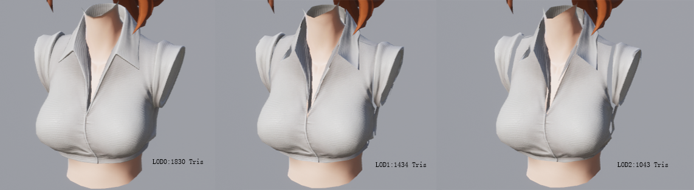
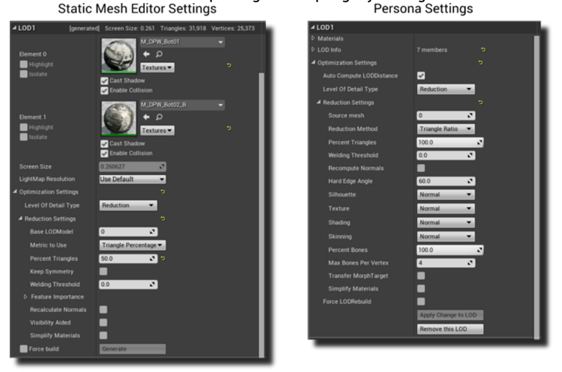

# Simplygon UE4使用

www.simplygon.com 下载免费版SDK，打开安装SDK，如果本地引擎有源码改动，需要自己手动编译Simplygon插件，否则直接安装SDK自带对应版本插件。

Simplygon集成分成标准集成（免费，公司环境需要配置代理才能使用）和高级集成：

* 标准集成包含模型（静态网格，骨骼）减面功能
* 高级集成需要离线的Simplygon证书，需要购买

## 免费版本减面功能

它支持静态网格和蒙皮网格减面功能，减面设置有以下选项：

设置LOD数量和每层LOD设置后，点击regenerate就可以生成LOD模型，
后期需要指定LOD根据屏幕比例LOD模型切换的策略，为减少动画的更新，还可以指定每层LOD移除更新的骨架