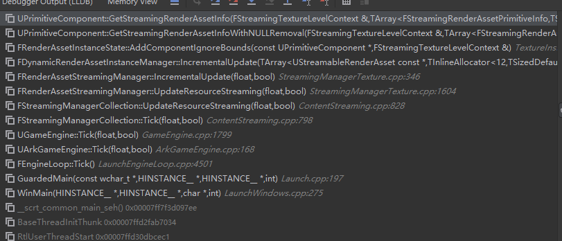

# UE4自定义渲染组件

---

## SceneComponent

UE场景最基础组件

---

## PrimitiveComponent

图元组件包含渲染，也包含物理碰撞，导航网格，资源串流等逻辑，是UE最常见组件

``` cpp 
class UXXXComponent : public UPrimitiveComponent
{
public:
    // 视锥裁剪相关
    FBoxSphereBounds 		CalcBounds(const FTransform& LocalToWorld) const override;
    
    // 渲染代理
    FPrimitiveSceneProxy*	CreateSceneProxy() override;

    virtual void            GetUsedMaterials(TArray<UMaterialInterface *>& OutMaterials, bool bGetDebugMaterials /* = false */) const;

    // Streaming相关接口
	/** Build the data to compute accuracte StreaminTexture data. */
	virtual bool            BuildTextureStreamingData(ETextureStreamingBuildType BuildType, EMaterialQualityLevel::Type QualityLevel, ERHIFeatureLevel::Type FeatureLevel, TSet<FGuid>& DependentResources) override;
	/** Get the StreaminTexture data include mesh, 此接口加入待流送的纹理、Mesh、关联的包围盒 & TexelFactor */
	virtual void            GetStreamingRenderAssetInfo(FStreamingTextureLevelContext& LevelContext, TArray<FStreamingRenderAssetPrimitiveInfo>& OutStreamingRenderAssets) const override;
};

class FXXXSceneProxy : public FPrimitiveSceneProxy
{
public:
    // View可见性接口实现，【关键】决定在MainView，Reflection Capture是否可见
    FPrimitiveViewRelevance GetViewRelevance(const FSceneView* View) const override;
    // 获取动态渲染元素
    void GetDynamicMeshElements(
        const TArray<const FSceneView*>& Views,
        const FSceneViewFamily& ViewFamily,
        uint32 VisibilityMap, 
        FMeshElementCollector& Collector) const override;
    // 获取静态渲染元素
    void DrawStaticElements(FStaticPrimitiveDrawInterface* PDI) override;

    // 获取光追元素
    void GetDynamicRayTracingInstances(FRayTracingMaterialGatheringContext& Context,
		TArray<FRayTracingInstance>& OutRayTracingInstances) override;
};
```

> UE4资源流送调用堆栈



> Primitive RenderState(Create_Concurrent)


> IStreamingManager，如果Component下的RenderState发生变化，需要显式调用`IStreamingManager::Get().NotifyPrimitiveUpdated(this)`

如何继承**UStreamableRenderAsset** ？

* Streamable RenderAsset仅支持单一文件单一LOD流送

如何流送单一资源文件，多物件流送？

* BulkData、RangeIO
* 自己继承IStreamingManager（^_^），单独管理

### Bulk data的使用

---

``` cpp
class IAsyncReadRequest;
typedef TFunction<void(bool bWasCancelled, IAsyncReadRequest*)> FAsyncFileCallBack;

class FByteBulkData
{
public:

GetFileName();

FBulkDataIORequest* 
    CreateStreamingRequest(
        EAsyncIOPriorityAndFlags Priority, 
        FAsyncFileCallBack* CompleteCallback, 
        uint8* UserSuppliedMemory) const;

FBulkDataIORequest* 
    CreateStreamingRequest(
        int64 OffsetInBulkData, int64 BytesToRead, 
        EAsyncIOPriorityAndFlags Priority, 
        FAsyncFileCallBack* CompleteCallback, 
        uint8* UserSuppliedMemory) const;
};
```

---

## AnyComponent

UE4中单一逻辑组件可用，类似体积云、虚拟纹理等，单独管理，单独渲染（无排序），需修改场景管理、渲染器渲染过程、材质Shader相关逻辑。

---

## MeshBatch & MeshCommand & RayTracingInstance

MeshBatch描述**单一VertexBuffer**不同Section的材质渲染，但实际只支持一个材质，但不同的MeshSection（**MeshBatchElement**）的特定材质参数可能不一样。

MeshPassProcessor会将MeshBatch转换成对应MeshCommand。