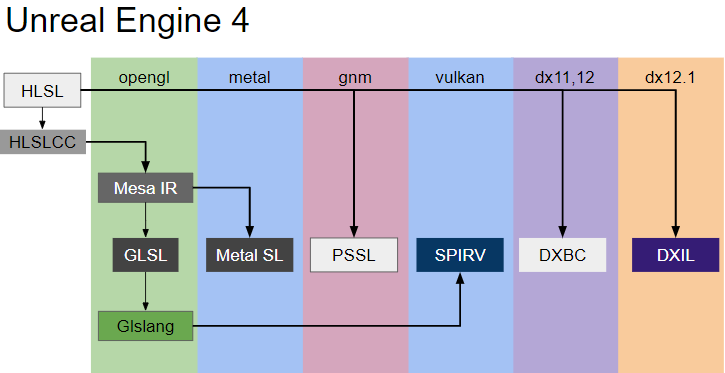
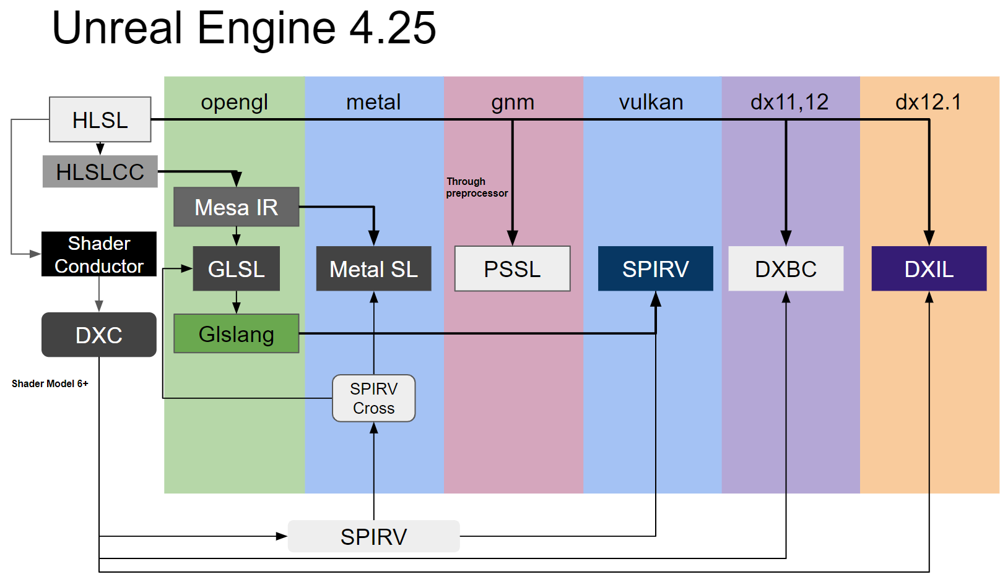
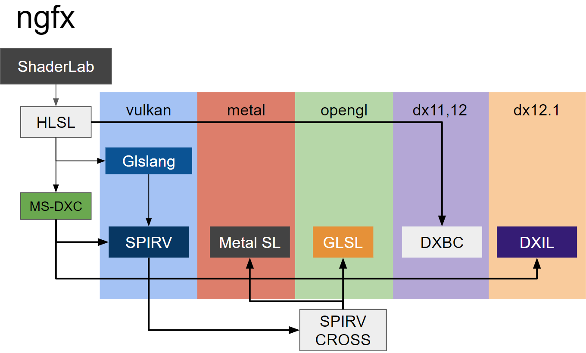

# 背景

过去的一年，笔者参与了一个比较特殊的Unity手游项目，由此开始了Unity学习的旅程。这个项目是由Unity4版本制作同时有整合原来公司自研引擎部分代码，结构比较混乱，这一年笔者也参与了项目的Unity2017/8的升级之路。

项目历史跨度较为久远，由于使用了OpenGL实现的NativeRenderPlugin，所以仅支持OpenGL的渲染，随着OpenGL逐渐退下历史舞台，项目也越来越急迫地需要被升级至最新的Unity版本。

在这段工作中，笔者将一些笔记记录在这个专栏（原先想写Unreal Insight的。。。），一边日后参考。

这篇文章主要记录一些引擎中的材质系统以及Shader编译上的思考。

Unity和Unreal都是跨平台的游戏引擎，而跨平台的基础包括材质描述语言(Shading Language)以及渲染器。在Shader语言上，Unity和Unreal都选择了广为使用的HLSL，这也不可避免的需要实现跨平台的Shader编译方案。

# Shader 编译差异

先看UE4.22的shader编译流程：

首先，Epic Games是一家拥有悠久历史的游戏引擎公司，UE4自己实现了SM5 Level的HLSL前端（使用Flex/Bison工具），结合MesaIR以及开源的Glslang库实现了一套多API兼容、多设备特性兼容的语言翻译器。

再看Unity3D的Shader编译流程：

Unity是一个小巧，并拥有精致内核的引擎，在编辑器层面实现了D3DCompiler.dll的跨平台（参考了Wine的PELoader），然后再通过DXBC翻译至多平台Shader语言，同时也能支持一些设备特性，由于D3DCompiler.dll是X86的指令，所以它的编译方案不支持移动设备上的HLSL Compute Shader编译。

现在到了2019年，微软基于LLVM/Clang生态开源了DirectXShaderCompiler，Google贡献了SPIRV的生成器，NVIDIA也在这个项目上提供了RTX SPIRV的翻译，DXR/RTX也将要开始推广了，如何翻新新的跨平台Shader编译方案？

目前，开源的支持HLSL编译的方案主要有微软的DXC以及Khronos的Glslang两个项目，DXC HLSL是微软官方和Google维护，Glslang HLSL主要是Google维护。

## Unity与UE4材质系统的差异

Unity这边主要使用ShaderLab作为材质描述语言，ShaderLab可以描述RenderPass以及RenderPipelineState，这对于未来渲染起的扩展是有益的，比如Prebake PipelineState Object；而UE4使用可视化节点表达式描述材质，两者各有优缺点。UE4的材质系统更适合美术使用，但控制不好容易排列组合爆炸，拖慢项目迭代进度；Unity的ShaderLab的排列组合更好控制（手动），这也带来了更快的迭代速度。

UE4的基础Shader修改也容易导致大量材质重新编译，当然你也可以使用Custom Shader Plugin或者自定义Shader节点实现相应的功能，

Unity 2017/8之后，官方也提供了与UE4类似的节点式材质编辑器。

## Shader语言上的思考

目前主流的实时渲染Shader文本语言主要有HLSL，GLSL，Metal SL，他们都基于类C语言发展而来，天生不能很好的支持模块化Shader编译（编程语言模块化的支持能一定程度提升编译效率）。因此曾经发明了CG语言的NVIDIA，在自家的Falcor渲染器上又基于HLSL的语法发明了Slang语言，来更好地支持模块化以及硬件特性扩展。

Metal Shading Language是基于C++14而来，Metal编译器生成的Binary Shader实际上是LLVM BitCode，虽然Metal SL编译器闭源，但网上也人在LLVM的基础上实现了开源的Metal SL编译器（Floor），目前的Metal API不提供Binary的Shader导出，得必须使用MacOS的Metal离线编译器才能生成Binary Code（用于Shader Cache提升加载速度），因此Floor或许是一个值得关注的项目。

那未来Shader语言又会如何进化呢？