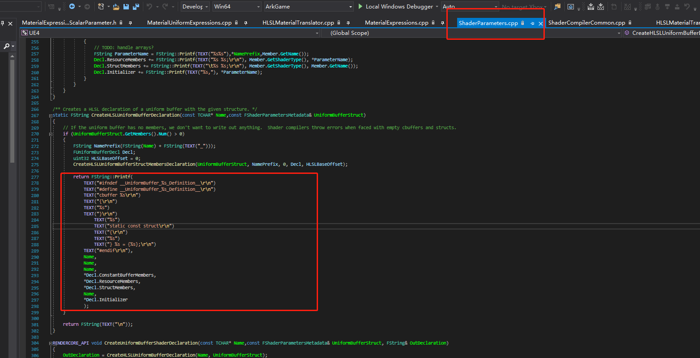
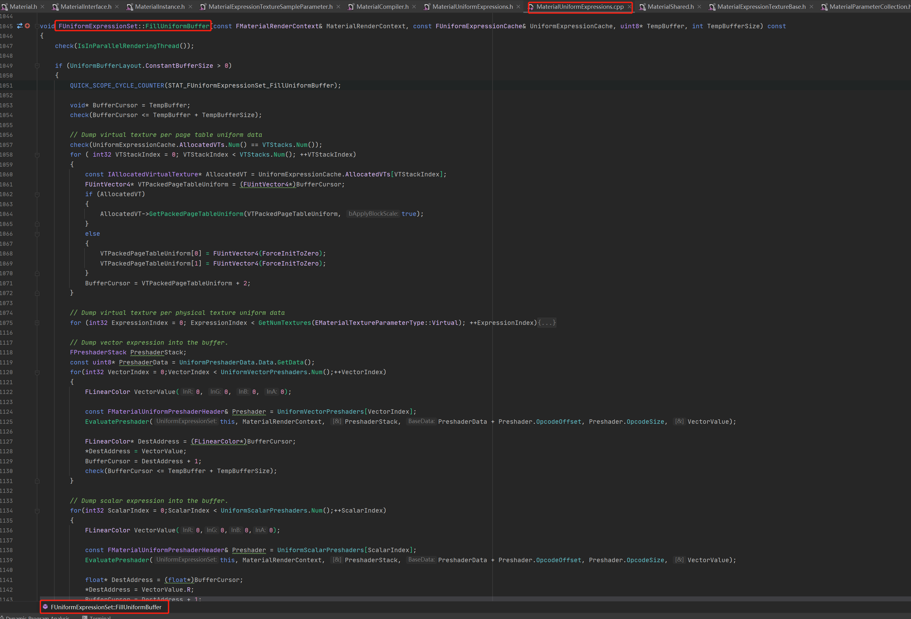
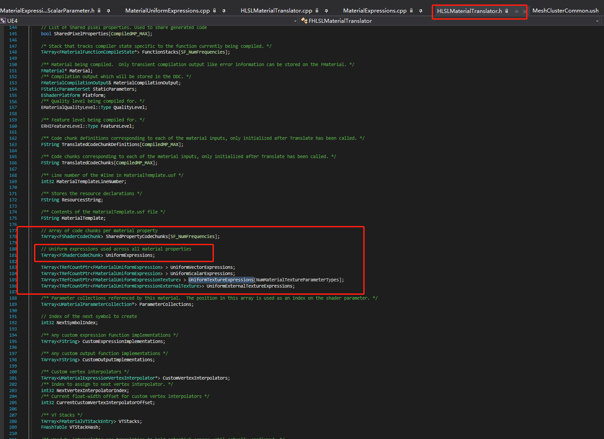
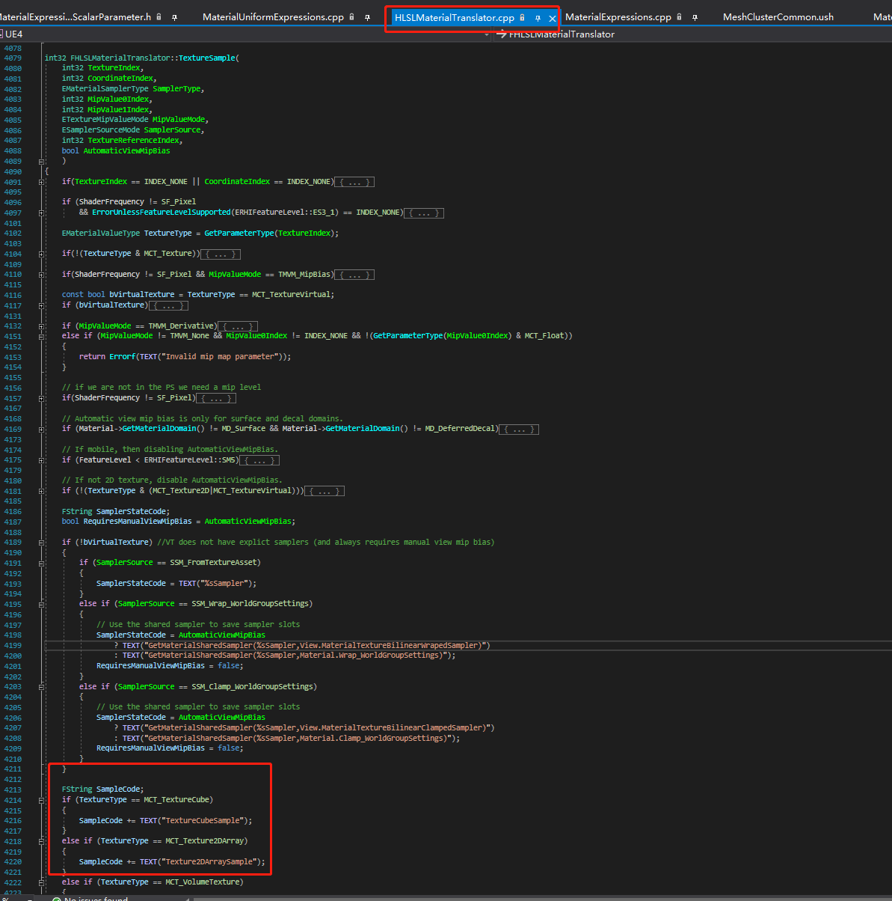
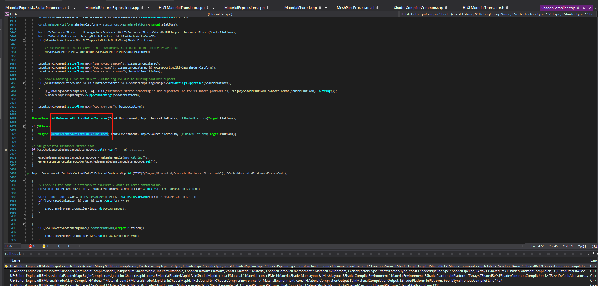
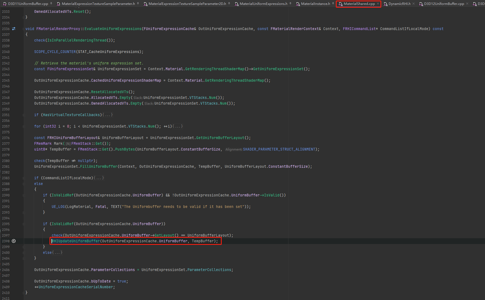
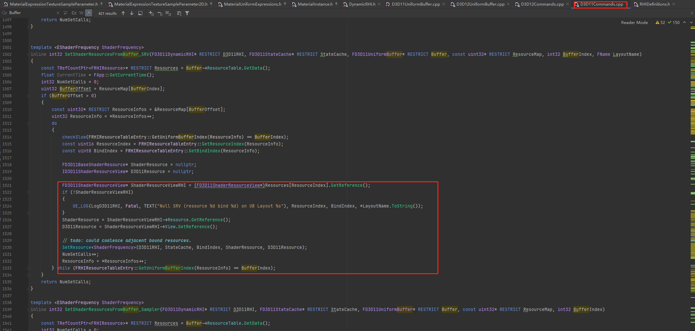

UE4 Shader编程
===

要想定制一些高级渲染效果或者优化Shader调度，就需要了解Shader编程语言特性，以及如何从底层shader编译开始改造或者扩展引擎能力

# 材质自定义代码节点（TA、AT视角）

---

# Shader Model Profiles（引擎工程师视角）

* Shader Model 6
* Metal shading language
* SPIRV
* PlayStation Shading Language


---

# C++定义和声明（图形工程师视角）

* Uniform声明
* UniformBuffer绑定（C++技巧）
* ShaderResource绑定
* Shader各平台编译

## C++代码中Uniform声明

```cpp
BEGIN_GLOBAL_SHADER_PARAMETER_STRUCT(FClusterCullCommonParameters,)
    SHADER_PARAMETER_TEXTURE(Texture2D, HZBTexture)
    SHADER_PARAMETER_SAMPLER(SamplerState, HZBSampler)
    SHADER_PARAMETER(FVector4,HZBRect)
    SHADER_PARAMETER(FVector,HZBUvFactor)
    SHADER_PARAMETER(FVector4,ViewRectAndExtra)
    SHADER_PARAMETER(FVector,PreviewTranslation)
    SHADER_PARAMETER(FVector,ViewLocation)
    SHADER_PARAMETER_ARRAY(FVector4, FrustumPlanes, [5])
    SHADER_PARAMETER(FMatrix,WorldToClip)
END_GLOBAL_SHADER_PARAMETER_STRUCT()

// cpp源码中实现
IMPLEMENT_GLOBAL_SHADER_PARAMETER_STRUCT(FClusterCullCommonParameters, "CullCommonParams");

//SetUniformBufferParameter
```

## 材质的Uniform声明（数据驱动的方式）

通过**FUniformExpressionSet**缓存的UniformExpression生成对应`CBuffer`和`Resources Declaration`




当然前面也需要UniformBuffer的填充（主要针对**Constants**）




## UE4材质编辑器如何从节点编辑器到最终的Shader？

* 先看`HLSLMaterialTranslator`
    
* 翻译**贴图采样**
    

* 最终Material Shader的组装
    

* 运行时Shader动态Uniform参数的**更新**
    

## Uniform绑定



```cpp

```

## ShaderResource绑定

SetShaderSRV
SetShadreUAV

## Shader跨平台编译

> Console平台shader和hlsl基本一致，只需要关键字或者函数重新Define或底层shader指令实现即可

## Shader优化点