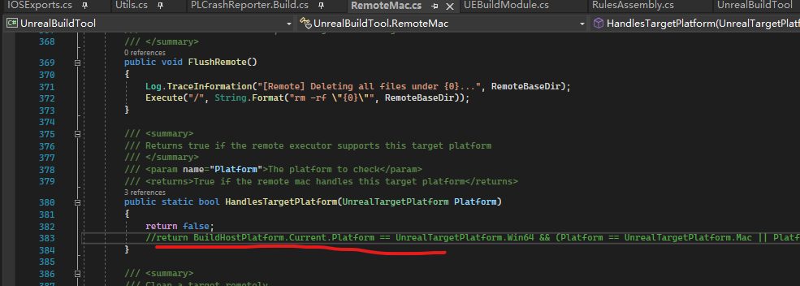

# Build UE5 iOS on Win10 Natively

- Compiler Toolchain
    - cctools
    - llvm-clang
- Asset Compiler
    - actool (opensource implementation)
- Interface Builder
    - ibtool (opensource implementation)
- Native Debugger for iOS
    - based on LLDB
    - VS Extension provided
    - lsp-debugger supported
- Native Instruments
    - also support linux/android OS
        - adreno GPU
        - powerVR GPU
        - mali GPU
        - Apple GPU
- Code Signer
    - support free developer build with Apple Software
        - download mobile provision files from `Apple Developer Service`
    - support paid developer account

---

# UnrealBuildTool Changes

- Validation Process
    
    

- Disable RemoteMac
    
    

- PLCrashReporter
    
    